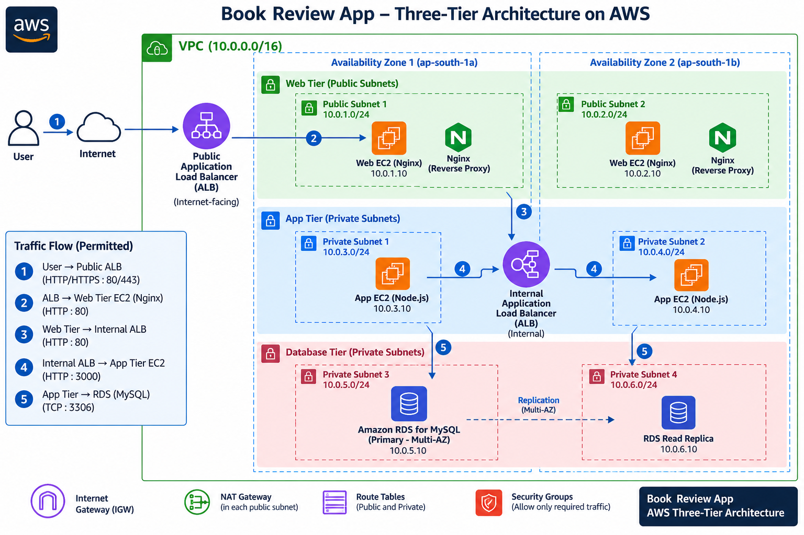
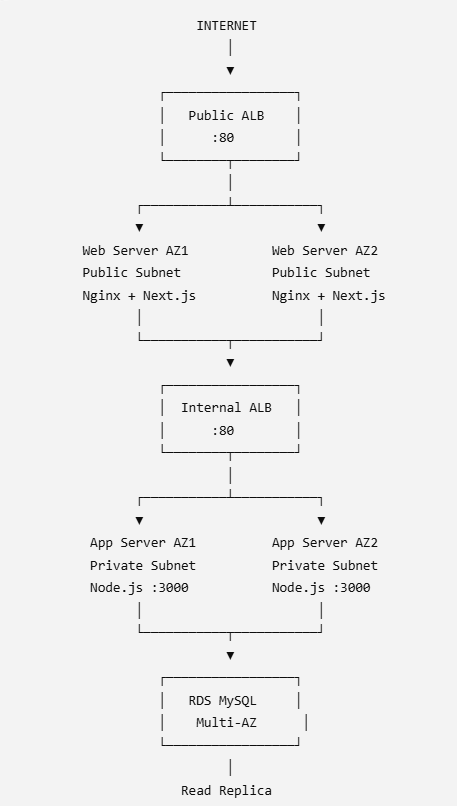
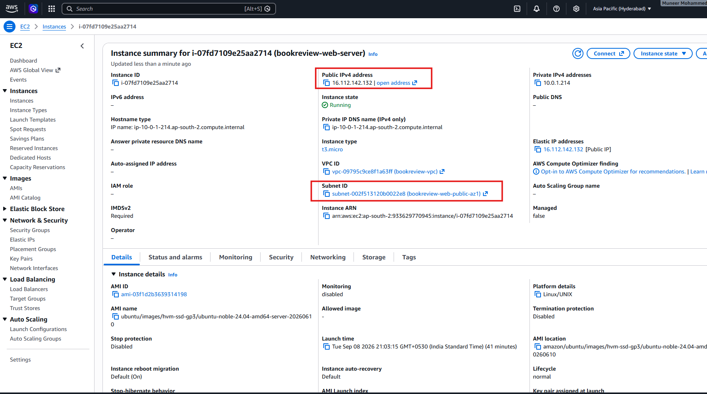
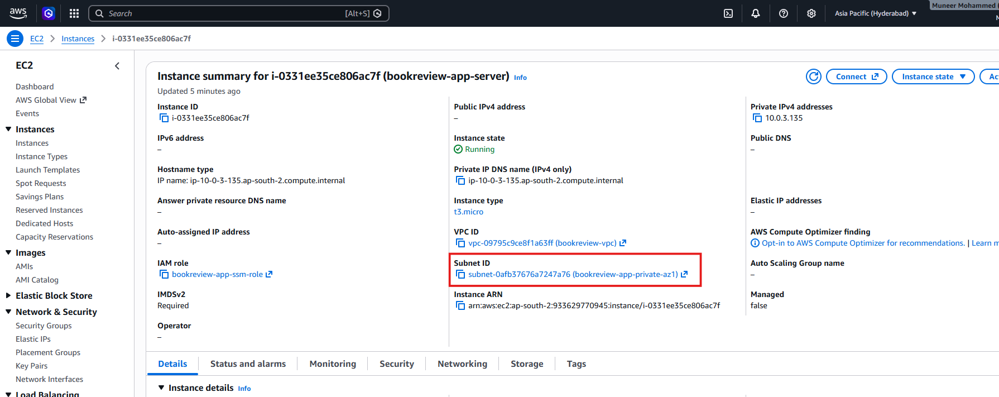
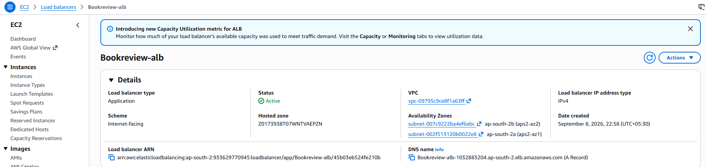
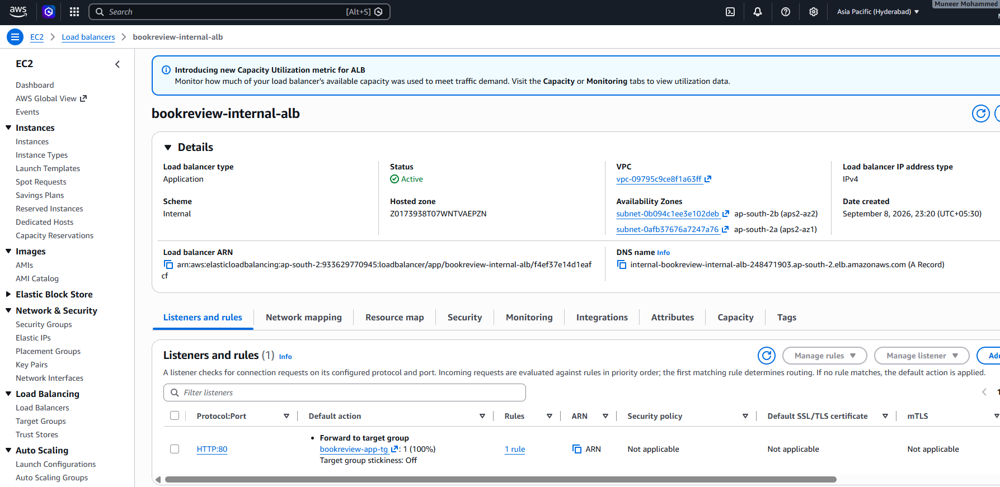
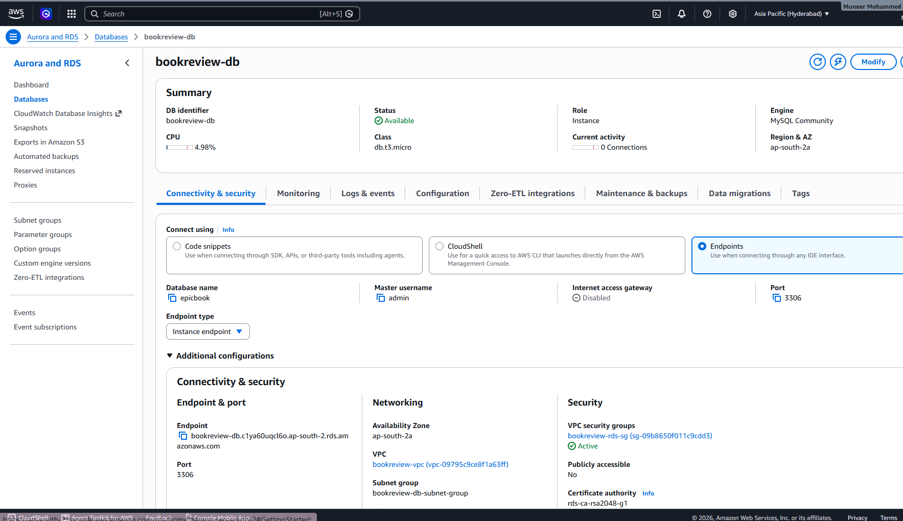
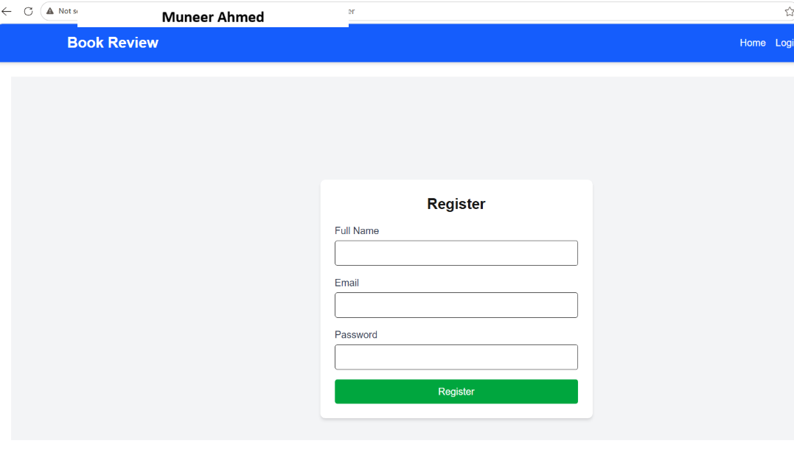
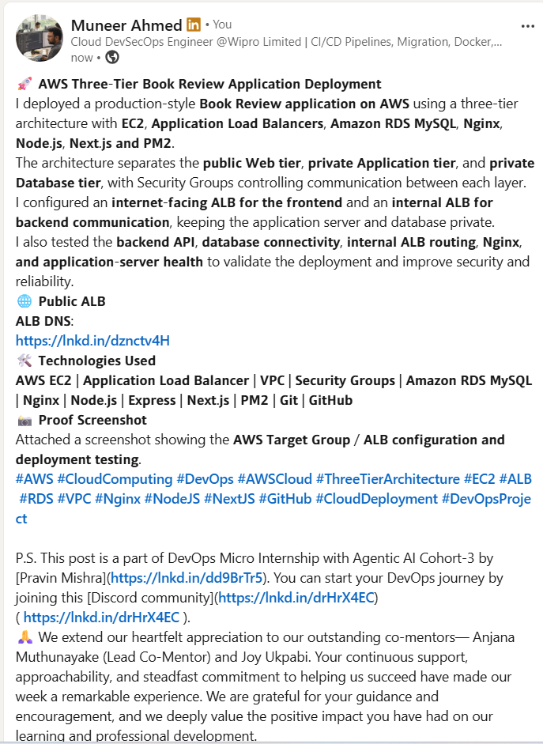

# Assignment 6 — Capstone: Deploy Book Review App (Three-Tier Architecture) on AWS

Part of the DevOps Micro Internship (DMI) Cohort 3 with Agentic AI

---

## Purpose

This is the most important assignment of the course. You will deploy the Book Review App in a fully production-style three-tier architecture on AWS: a Next.js Web Tier behind Nginx and a public ALB, a private Node.js/Express App Tier behind an internal ALB, and a private Multi-AZ MySQL RDS database with a read replica. You are expected to design, deploy, isolate, debug, and document the result independently.

---

# Task 1 — Architecture Diagram

## Goal

Create an architecture diagram showing the custom VPC (10.0.0.0/16), the six subnets across two Availability Zones (two public Web Tier, two private App Tier, two private Database Tier), the public ALB, Web Tier EC2/Nginx, internal ALB, private App Tier EC2, private Multi-AZ RDS with its read replica, and the permitted traffic flow.

### Evidence

#### Diagram image or link

# Task 2 — AWS Region & Services Used

## Goal

Record the AWS Region used and list every AWS service used across networking, compute, load balancing, security, and the database.

### Notes

**Region:**

Asia Pacific (Hyderabad) — ap-south-2

**Services used:**

Amazon VPC — Custom VPC (10.0.0.0/16)
Amazon EC2 — Web Tier and App Tier instances
Application Load Balancer (ALB) — Public/Internet-facing ALB
Application Load Balancer (ALB) — Internal ALB
Nginx — Reverse proxy for the Web Tier
Node.js / Express — Backend application
Amazon RDS for MySQL — Primary database with Multi-AZ
Amazon RDS Read Replica
Internet Gateway (IGW)
NAT Gateway
Route Tables
Security Groups
Six Subnets across two Availability Zones

# Task 3 — Public Entry Point

## Goal

Confirm the Book Review App loads through the public ALB DNS name.

### Evidence

#### Public ALB DNS

Paste your public ALB DNS name here:

http://internal-bookreview-internal-alb-248471903.ap-south-2.elb.amazonaws.com/

# Task 4 — Evidence Screenshots

## Goal

Capture visual proof of every tier and load balancer.

### Evidence

#### Screenshot 1 — Web Tier EC2 instance in a public subnet

#### Screenshot 2 — App Tier EC2 instance in a private subnet

#### Screenshot 3 — Public Application Load Balancer configuration or healthy targets

#### Screenshot 4 — Internal Application Load Balancer configuration or healthy targets

#### Screenshot 5 — Amazon RDS for MySQL showing Multi-AZ and the read replica

#### Screenshot 6 — Book Review App UI working through the public ALB

# Task 5 — Summary

## Goal

Summarize what worked in the final deployment, the issues encountered and how each was fixed, and the tools or sources used to research and debug.

### Notes

**What worked:**

Created a three-tier AWS architecture in the Asia Pacific (Hyderabad) ap-south-2 region consisting of public Web, private Application, and private Database layers.
Successfully launched the Web Server EC2 instance in the public subnet and configured Nginx + Next.js for the frontend.
Successfully launched the App Server EC2 instance in the private subnet and configured the Node.js/Express backend on port 3000 using PM2.
Successfully connected the backend application to the Amazon RDS MySQL database using Sequelize and SSL.
Successfully created the internal Application Load Balancer and configured it to forward traffic to the App Server.
The internal ALB target on port 3000 became Healthy, and testing from the Web Server confirmed successful communication:
curl http://internal-bookreview-internal-alb-248471903.ap-south-2.elb.amazonaws.com/
Backend API testing was successful. The /api/books endpoint returned book data correctly.
Configured separate security groups for the Public ALB, Web Server, Internal ALB, App Server, and RDS following a layered architecture.
Configured Nginx to serve the Next.js frontend and prepare /api requests for forwarding to the internal ALB.

**Issues encountered and fixes:**

1. Backend port mismatch

Issue: The backend initially had inconsistent port configuration.

Fix: Corrected the backend environment configuration to use:

PORT=3000

The backend was then successfully started and tested on port 3000.

2. Internal ALB target initially used port 80

Issue: The App Server was running the Node.js backend on port 3000, while the target group initially registered the instance on port 80.

Fix: Registered the App Server target using port 3000. The target subsequently became Healthy.

3. Frontend API URL configuration

Issue: The frontend contained inconsistent API URL references, including localhost and /api path combinations.

Fix: Configured production frontend communication to use the same-origin API path:

NEXT_PUBLIC_API_URL=/api

This allows the browser to communicate through the public ALB and Nginx instead of directly accessing the private internal ALB.

4. Public ALB target remained unhealthy

Issue: The Public ALB target group bookreview-web-tg reported:

Unhealthy
Request timed out

Troubleshooting performed:

Verified Nginx was running.
Verified Nginx was listening on:
0.0.0.0:80
Verified:
curl -I http://127.0.0.1

returned HTTP 200 OK.

Verified:
curl -I http://10.0.1.214

also returned HTTP 200 OK.

Verified Ubuntu UFW firewall was inactive.
Verified Web Server Security Group allowed HTTP 80 from bookreview-public-alb-sg.
Verified Public ALB Security Group allowed HTTP 80 from the internet and unrestricted outbound traffic.
Verified the Web subnet Network ACL allowed all inbound and outbound traffic.

At the point of documentation, the Public ALB → Web Server health-check timeout was still under investigation, while the Web Server itself and the internal application path were functioning correctly.

5. AWS Free Tier limitation for RDS high availability

Issue: The assignment requested RDS Multi-AZ/read-replica configuration, but the available AWS Free Tier subscription did not provide the required deployment option without additional charges.

Fix: Kept the RDS database as a Single-AZ deployment to avoid unexpected charges. The limitation should be documented in the assignment rather than creating paid resources.

**Tools/sources used:**

AWS Management Console — EC2, VPC, Security Groups, Target Groups, Load Balancers, RDS and networking configuration.
Ubuntu/Linux Terminal — used for application installation, configuration and troubleshooting.
Nginx — frontend web server and reverse proxy.
Node.js / Express — backend API.
PM2 — Node.js process management.
Next.js — frontend application.
MySQL / Amazon RDS — application database.
Git and GitHub — source-code repository and deployment.
curl — tested frontend, backend API and internal ALB connectivity.
ss — verified that Nginx was listening on TCP port 80.
UFW — checked the Ubuntu firewall status.
AWS documentation — referenced for ALB target groups, health checks, target ports and networking behavior.
GitHub repository: pravinmishraaws/book-review-app

# LinkedIn Post (Required)

## Goal

Publish a LinkedIn post sharing the capstone deployment, including the public ALB DNS (or a redacted screenshot), three to five lines on what you built and why it is production-style, and one proof screenshot.

## Evidence

#### LinkedIn Post URL

https://lnkd.in/p/dQCDzWi5

#### Screenshot — Published LinkedIn post

# Submission Instructions

- Add all required screenshots and links in your submission
- Do not expose passwords, RDS credentials, connection strings, private keys, or account IDs

---

# Completion Checklist

- [x] Task 1: Architecture diagram completed
- [x] Task 2: AWS Region and services documented
- [x] Task 3: Public ALB DNS confirmed working
- [x] Task 4: All six evidence screenshots captured (Web Tier, App Tier, both ALBs, RDS + replica, app UI)
- [x] Task 5: Deployment summary completed (what worked, issues/fixes, tools/sources)
- [x] LinkedIn post published and URL submitted
- [x] App Tier and Database Tier confirmed not publicly accessible
- [x] No sensitive data exposed

---

## 📌 About DMI & CloudAdvisory

DevOps Micro Internship (DMI) is a project-based DevOps program run by Pravin Mishra (The CloudAdvisory) focused on real-world execution, systems thinking, and career readiness.

It helps learners build strong DevOps foundations with hands-on experience.

---

## 📌 Resources

- 🌐 DMI Official Website: https://dmi.pravinmishra.com?utm_source=github&utm_medium=readme  
- 🎓 University: https://university.pravinmishra.com?utm_source=github&utm_medium=readme  
- 💬 Discord Community: https://discord.pravinmishra.com?utm_source=github&utm_medium=readme  
- 📝 Blog: https://dmi.pravinmishra.com/blog?utm_source=github&utm_medium=readme  
- ▶️ YouTube Playlist: https://www.youtube.com/playlist?list=PLFeSNDtI4Cho  
- 🔗 Pravin Mishra (LinkedIn): https://www.linkedin.com/in/pravin-mishra-aws-trainer/  
- 🏢 CloudAdvisory (LinkedIn): https://www.linkedin.com/company/thecloudadvisory/

---

*This submission is part of DevOps Micro Internship (DMI) Cohort 3 — Agentic AI Track.*
