# Assignment 02 — Provision Linux VMs with Terraform and Run Ansible Ad-Hoc Commands

Part of the DevOps Micro Internship (DMI) with Agentic AI

---

## Purpose

In this assignment, you will use Terraform to provision three or four Ubuntu Linux Virtual Machines on either Microsoft Azure or Amazon Web Services.

You will configure SSH key-based authentication, organize the servers using a custom Ansible inventory, and run Ansible ad-hoc commands across individual hosts and inventory groups.

---

# Task 1 — Create the Multi-Host Lab Structure

## Goal

Create a separate project directory for the multi-host lab and prepare the Terraform, Ansible, and documentation files.

This project will use the Git repository and Ansible controller prepared in Assignment 01.

### Evidence

#### Screenshot 1 — Terminal showing the complete `ansible-adhoc-lab` project structure

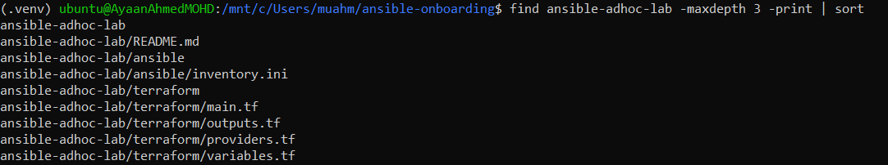

#### Screenshot 2 — Terminal showing `git status --short` with the new project files and updated `.gitignore`

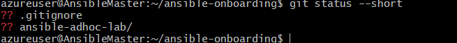

### Notes

Add your task notes here.

Created the ansible-adhoc-lab project structure to organize the Terraform and Ansible configuration for provisioning and managing AWS EC2 instances.

The project structure separates infrastructure provisioning from configuration management, making the environment easier to maintain and reuse. Terraform is used to provision the AWS resources, while Ansible is used to manage the provisioned servers and execute Ad-Hoc commands.

The .gitignore file was also updated to prevent sensitive and unnecessary files such as Terraform state files, private keys, and local environment files from being committed to the Git repository.

The git status --short command was used to verify the newly created project files and confirm the repository changes before committing them.

# Task 2 — Create the Terraform Configuration

## Goal

Create the Terraform configuration required to provision three or four Ubuntu Linux VMs on your selected cloud platform.

Complete only one option:

- Option A — Microsoft Azure
- Option B — Amazon Web Services

Do not configure both providers for this assignment.

### Evidence

#### Screenshot 3 — Terraform configuration showing the three or four server roles and the `for_each` or `count` implementation

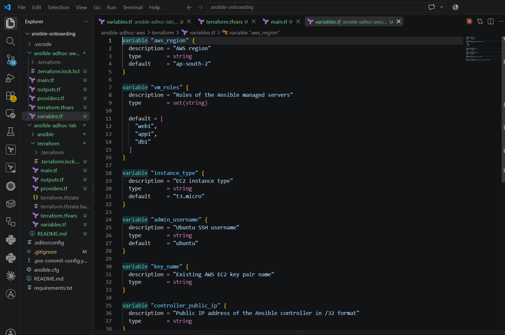
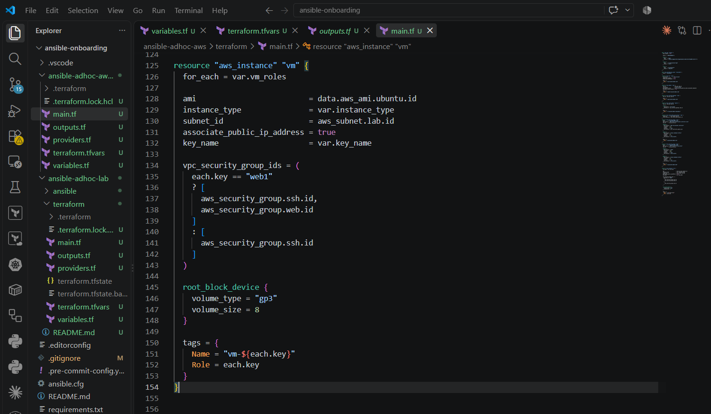

#### Screenshot 4 — Terraform configuration showing SSH restricted to the controller IP and HTTP allowed only for web hosts

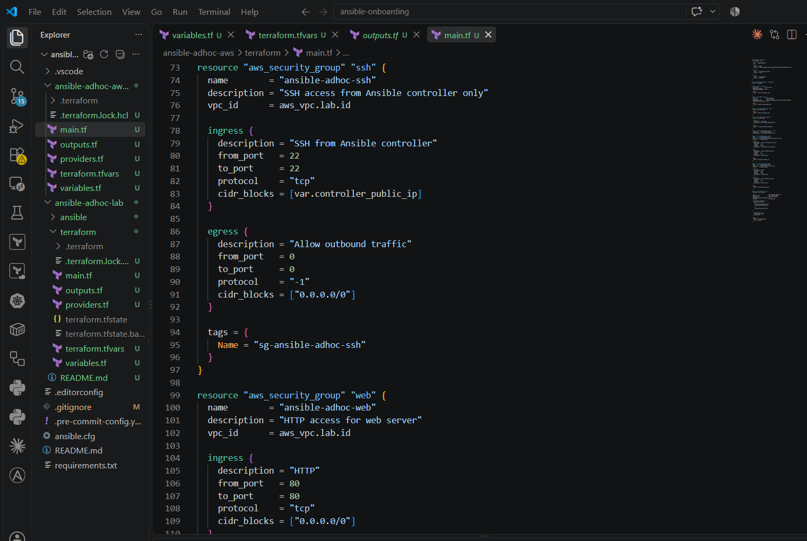

#### Screenshot 5 — Terraform output configuration showing how public IP addresses are associated with the server roles

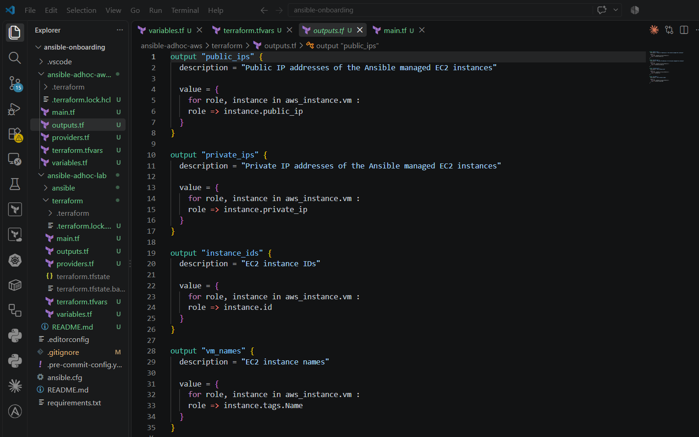

### Notes

Add your task notes here.

Terraform was used to provision the AWS infrastructure required for the Ansible Ad-Hoc lab. The infrastructure was designed using reusable Terraform configuration with for_each to create multiple servers based on their assigned roles.

The environment includes separate server roles such as the Ansible controller, web servers, and database server. Each EC2 instance is created from the same Terraform resource while its configuration is determined by the role definition.

Security groups were configured according to the server roles. SSH access is restricted to the controller IP rather than being exposed to the entire internet. HTTP access is enabled only for the web-server security group.

Terraform outputs are used to display the public IP addresses of the provisioned servers, making it easier to identify the target machines when configuring the Ansible inventory and executing Ansible Ad-Hoc commands.

This approach demonstrates infrastructure automation, role-based security-group configuration, Terraform for_each, and integration of Terraform-provisioned AWS infrastructure with Ansible.

# Task 3 — Provision the Infrastructure with Terraform

## Goal

Initialize and validate the Terraform configuration, review the execution plan, provision the selected three or four VMs, and retrieve their public IP addresses.

### Evidence

#### Screenshot 6 — Final `terraform apply` output showing `Apply complete`

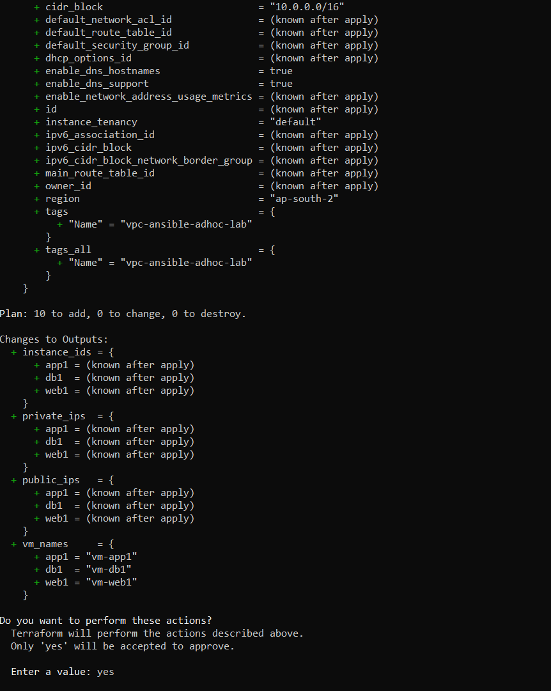
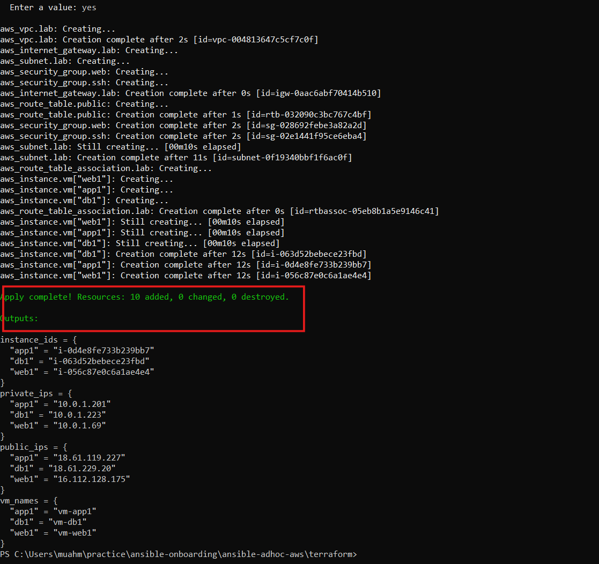

#### Screenshot 7 — `terraform output public_ips` showing the role-to-IP mapping for all three or four VMs

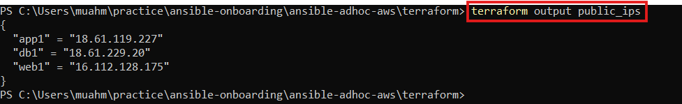

#### Screenshot 8 — Azure Portal or AWS Management Console showing all three or four VMs in the `Running` state, with their role-based names visible

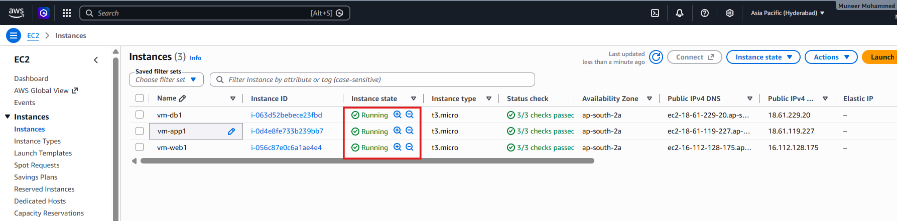

### Notes

Add your task notes here.

Successfully completed the Terraform infrastructure deployment for the Ansible Ad-Hoc lab. Terraform was used to provision the required AWS resources and create the web1, app1, and db1 server instances.

The Terraform configuration uses reusable resources and outputs to capture the instance IDs, private IP addresses, public IP addresses, and VM names. The deployment plan was reviewed before applying the configuration to ensure that the expected resources would be created without modifying or destroying existing infrastructure.

This infrastructure provides the required AWS environment for the next stage of the lab, where Ansible will be used to connect to the servers and execute Ad-Hoc commands for administration and configuration management.

# Task 4 — Verify SSH Key-Based Access

## Goal

Verify that each managed VM can be accessed from the Ansible controller using SSH key-based authentication.

### Evidence

#### Screenshot 9 — Terminal showing successful SSH hostname output from all VMs

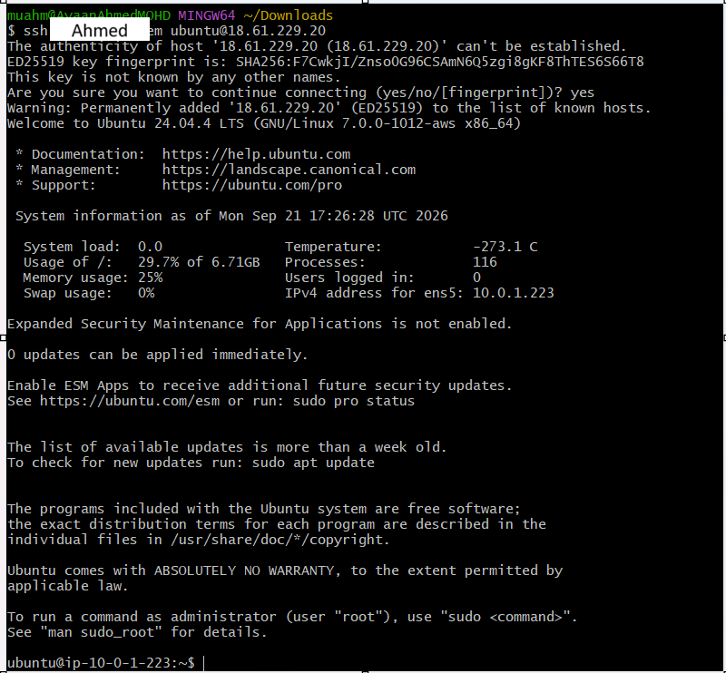
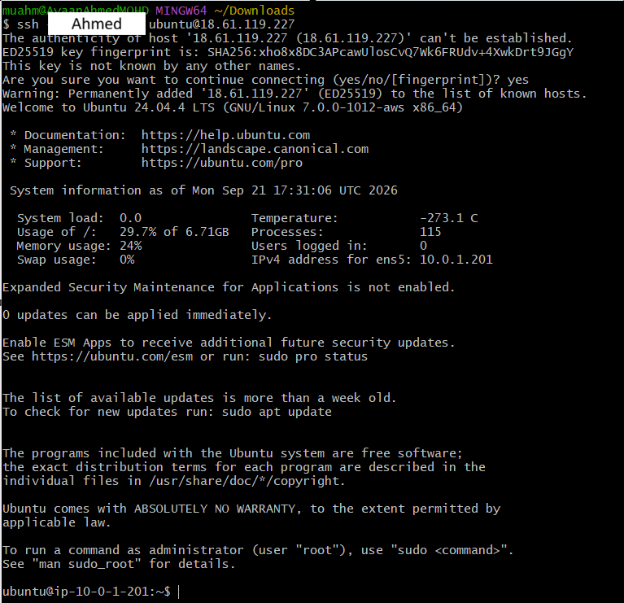
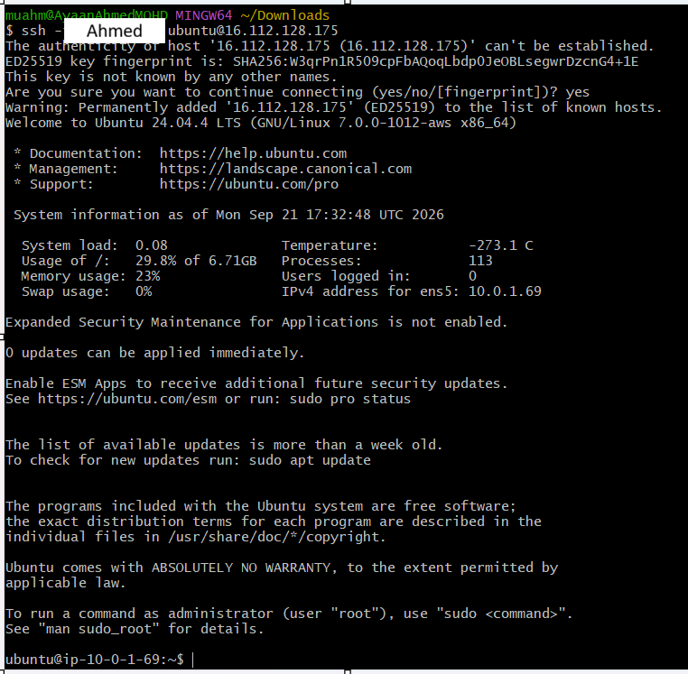

### Notes

Add your task notes here.

Successfully verified SSH connectivity from the Ansible controller to all provisioned AWS virtual machines.

The hostname command was executed on each target VM and returned the expected hostnames, confirming that the servers are reachable through SSH and that the Ansible controller can communicate with the managed nodes.

The successful connectivity test verifies that the AWS infrastructure, networking, SSH configuration, security groups, and SSH authentication are working correctly. The environment is now ready for executing Ansible Ad-Hoc commands against the managed servers.

# Task 5 — Create the Custom Ansible Inventory

## Goal

Create an Ansible inventory file that groups the managed VMs by role.

The inventory allows Ansible to run commands against all servers, or only specific groups such as `web`, `app`, or `db`.

### Evidence

#### Screenshot 10 — `inventory.ini` showing the `web`, `app`, and `db` groups

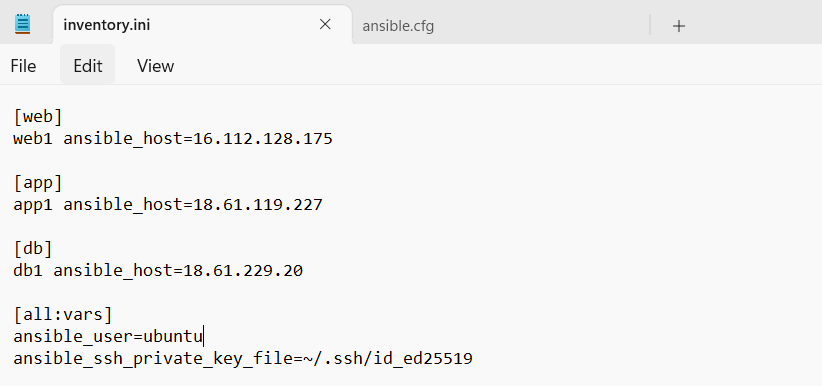

#### Screenshot 11 — Output of `ansible-inventory -i inventory.ini --graph`

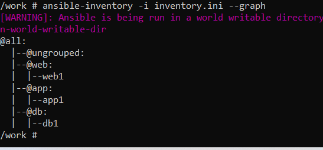

### Notes

Add your task notes here.

Created a custom Ansible inventory file, inventory.ini, to organize the AWS managed VMs according to their server roles.

The inventory contains separate groups for web, app, and db servers. This grouping allows Ansible Ad-Hoc commands to be executed against all managed nodes or against a specific server role.

The ansible-inventory --graph command was used to verify the inventory structure and confirm that the managed VMs were correctly assigned to their respective groups.

The inventory provides a clear and reusable foundation for managing the AWS infrastructure through Ansible.

# Task 6 — Run Ansible Ad-Hoc Commands

## Goal

Run Ansible ad-hoc commands from the controller to verify connectivity, check server information, and manage packages and services across inventory groups.

This task proves that the inventory is working and that Ansible can control multiple managed VMs without writing a playbook.

### Evidence

#### Screenshot 12 — Output of `ansible all -i inventory.ini -m ping`

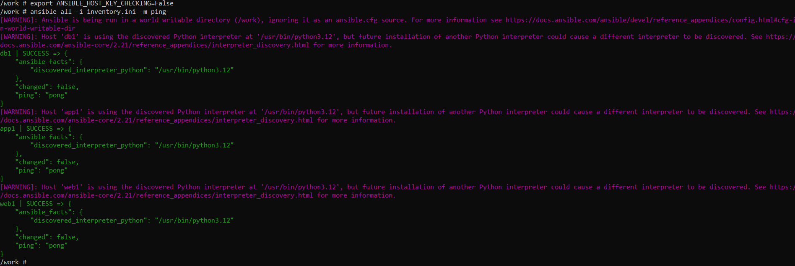

#### Screenshot 13 — Output of `ansible all -i inventory.ini -m command -a "uptime"`

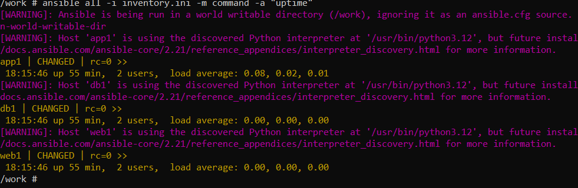

#### Screenshot 14 — Output of `ansible web -i inventory.ini -m apt -a "name=nginx state=present update_cache=yes" --become`

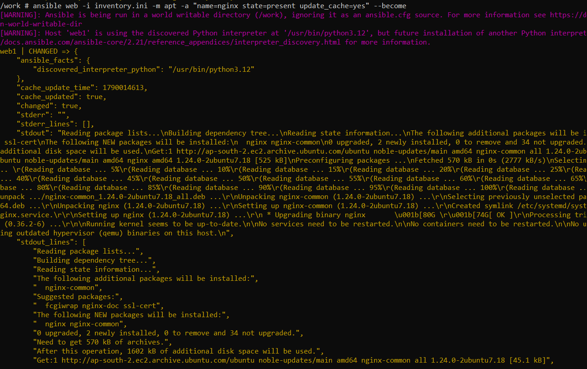

#### Screenshot 15 — Output of `ansible web -i inventory.ini -m service -a "name=nginx state=started enabled=yes" --become`

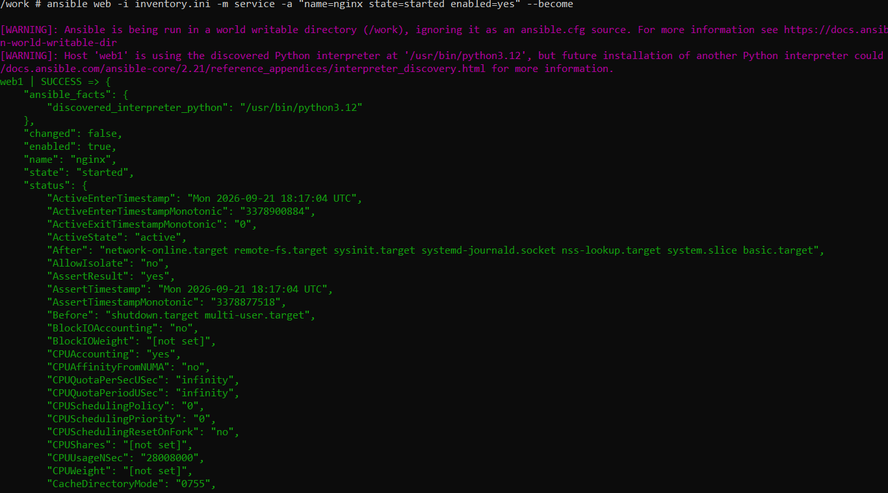

#### Screenshot 16 — Output of `ansible all -i inventory.ini -m apt -a "name=htop state=present update_cache=yes" --become`

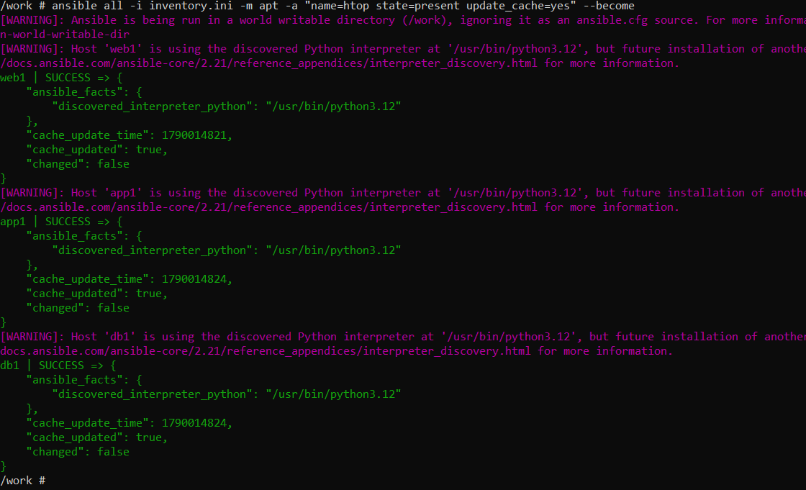

#### Screenshot 17 — Output of `ansible web -i inventory.ini -m command -a "systemctl is-active nginx"`

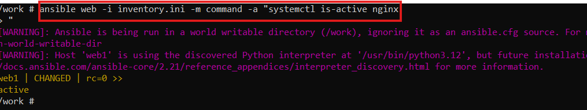

### Notes

Add your task notes here.

Successfully executed Ansible Ad-Hoc commands from the controller against the managed AWS VMs.

The ping module was used to verify Ansible connectivity, while the uptime command was used to check the system status of the managed nodes.

The apt module was used to install Nginx on the web servers and htop across the managed servers. The --become option was used where elevated privileges were required.

The Ansible service module was used to start and enable the Nginx service on the web servers. The final systemctl is-active nginx command confirmed that Nginx was running successfully.

These tasks demonstrate that Ansible can remotely execute commands, install packages, and manage services across multiple server groups without requiring a playbook.

# LinkedIn Post Required

## Evidence

#### LinkedIn Post URL

Paste your LinkedIn post URL here:

https://lnkd.in/p/d-VYdBjx

#### Screenshot — Published LinkedIn post

Add your screenshot here.

---

# Assignment Questions

Answer the following in your own words:

**1. What is the purpose of an Ansible inventory file?**

Add your answer here.

---

**2. What is the difference between the `web`, `app`, and `db` groups in your inventory?**

Add your answer here.

---

**3. What does the Ansible `ping` module verify?**

Add your answer here.

---

**4. Why do package installation commands require `--become`?**

Add your answer here.

---

**5. When would you use an ad-hoc command instead of a playbook?**

Add your answer here.

---

**6. What is one challenge you faced while setting up SSH or inventory, and how did you fix it?**

Add your answer here.

---

# Required Files

Confirm that the following files are included in your assignment workspace:

- [ ] `ansible-adhoc-lab/README.md`
- [ ] `ansible-adhoc-lab/terraform/providers.tf`
- [ ] `ansible-adhoc-lab/terraform/main.tf`
- [ ] `ansible-adhoc-lab/terraform/variables.tf`
- [ ] `ansible-adhoc-lab/terraform/outputs.tf`
- [ ] `ansible-adhoc-lab/ansible/inventory.ini`
- [ ] Updated `.gitignore`

---

# Submission Instructions

- Add all required screenshots from the tasks.
- Full Name must be visible in required screenshots.
- Mention whether you used Azure or AWS.
- Mention whether you used the three-VM option or four-VM option.
- Add the public IP addresses of the VMs, redacted if preferred.
- Add your `inventory.ini` proof.
- Add a short explanation of what you learned.
- Answer all assignment questions clearly in your own words.
- Add your LinkedIn post URL.
- Do not expose SSH private keys, Terraform state files, cloud credentials, passwords, access keys, secret keys, account IDs, or subscription IDs.

---

# Completion Checklist

- [ ] Task 1: `ansible-adhoc-lab` project structure created
- [ ] Task 1: `.gitignore` updated for Terraform files
- [ ] Task 2: Terraform configuration created
- [ ] Task 2: Server roles defined for either three or four VMs
- [ ] Task 2: `count` or `for_each` used
- [ ] Task 2: SSH restricted to the controller public IP
- [ ] Task 2: HTTP allowed only for web hosts
- [ ] Task 2: Terraform output maps roles to public IPs
- [ ] Task 3: Terraform initialized successfully
- [ ] Task 3: Terraform configuration validated
- [ ] Task 3: Terraform apply completed successfully
- [ ] Task 3: All selected VMs are running
- [ ] Task 4: SSH key-based access works for every VM
- [ ] Task 5: `inventory.ini` contains `web`, `app`, and `db` groups
- [ ] Task 5: `ansible-inventory -i inventory.ini --graph` shows the correct groups
- [ ] Task 6: `ansible all -i inventory.ini -m ping` returns `SUCCESS`
- [ ] Task 6: Ad-hoc commands run successfully
- [ ] Task 6: `--become` was used for package and service tasks
- [ ] Task 6: Nginx is active on the `web` group
- [ ] Screenshots 1–17 are included
- [ ] Assignment questions are answered
- [ ] LinkedIn post published
- [ ] LinkedIn post URL added
- [ ] No sensitive information is exposed

---

## About DMI & CloudAdvisory

DevOps Micro Internship (DMI) is a project-based DevOps program run by Pravin Mishra and The CloudAdvisory, focused on real-world execution, systems thinking, and career readiness.

It helps learners build strong DevOps foundations with hands-on experience.

---

## Resources

- DMI Official Website: [https://dmi.pravinmishra.com?utm_source=github&utm_medium=readme](https://dmi.pravinmishra.com?utm_source=github&utm_medium=readme)
- University: [https://university.pravinmishra.com?utm_source=github&utm_medium=readme](https://university.pravinmishra.com?utm_source=github&utm_medium=readme)
- Discord Community: [https://discord.pravinmishra.com?utm_source=github&utm_medium=readme](https://discord.pravinmishra.com?utm_source=github&utm_medium=readme)
- Blog: [https://dmi.pravinmishra.com/blog?utm_source=github&utm_medium=readme](https://dmi.pravinmishra.com/blog?utm_source=github&utm_medium=readme)
- YouTube Playlist: [https://www.youtube.com/playlist?list=PLFeSNDtI4Cho](https://www.youtube.com/playlist?list=PLFeSNDtI4Cho)
- Pravin Mishra LinkedIn: [https://www.linkedin.com/in/pravin-mishra-aws-trainer/](https://www.linkedin.com/in/pravin-mishra-aws-trainer/)
- CloudAdvisory LinkedIn: [https://www.linkedin.com/company/thecloudadvisory/](https://www.linkedin.com/company/thecloudadvisory/)

---

*This submission is part of DevOps Micro Internship (DMI) — Agentic AI Track.*