# Assignment 03 — Deploy a Static Website to Multiple Servers Using a Multi-Play Ansible Playbook

Part of the DevOps Micro Internship (DMI) with Agentic AI

---

## Student Details

**Full Name:** Muneer Ahmed Mohammed
**Cloud Platform Used:** AWS 
**Server 1 URL:** `http://18.60.53.7`  
**Server 2 URL:** `http://16.113.136.177`

---

## Purpose

In this assignment, you will create a multi-play Ansible playbook to install Nginx, deploy a static website to two Ubuntu servers, and verify that the website is accessible from both servers.

You may use either AWS EC2 instances or Azure Virtual Machines as your managed servers.

---

# Task 1 — Create the Project Structure

## Goal

Create the required folders and files for the Ansible project.

## Evidence

### Screenshot 1 — Terminal or VS Code showing the complete `static-web` project structure

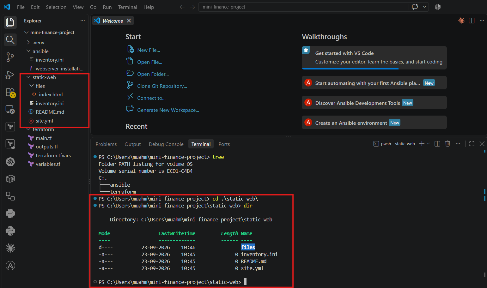

# Task 2 — Configure the Ansible Inventory

## Goal

Add both Ubuntu servers to the Ansible inventory.

## Evidence

### Screenshot 2 — Output of `ansible-inventory -i inventory.ini --graph` showing `web1` and `web2`

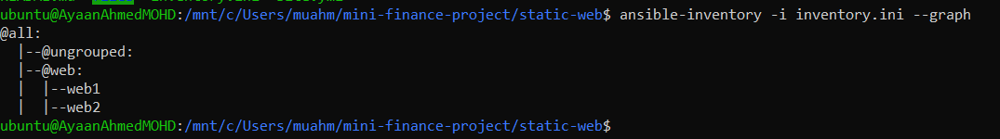

## Configuration File

Copy and paste the complete contents of your `inventory.ini` file below:

[web]
web1 ansible_host=18.60.53.7
web2 ansible_host=16.113.136.177

[web:vars]
ansible_user=ubuntu
ansible_ssh_private_key_file=/home/muahm/.ssh/mini-finance-key

# Task 3 — Verify Ansible Connectivity

## Goal

Confirm that the Ansible controller can connect to both servers.

## Evidence

### Screenshot 3 — Ansible ping output showing `SUCCESS` and `pong` for both servers

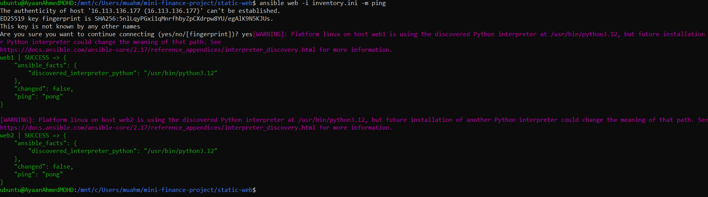

# Task 4 — Download and Personalize the Static Website

## Goal

Download `index.html` to the Ansible controller and personalize the website with your full name.

## Evidence

### Screenshot 4 — Edited `files/index.html` showing the footer line with your full name

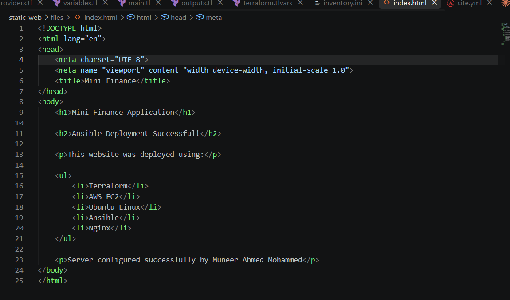

# Task 5 — Create the Multi-Play Ansible Playbook

## Goal

Create a single Ansible playbook containing separate plays for installation, deployment, and verification.

## Configuration File

Copy and paste the complete contents of your `site.yml` file below:

```yaml
Add your site.yml content here.
```
---
- name: Configure Mini Finance Web Servers
  hosts: web
  become: true

  tasks:

    - name: Update apt package cache
      ansible.builtin.apt:
        update_cache: true
        cache_valid_time: 3600

    - name: Install Nginx
      ansible.builtin.apt:
        name: nginx
        state: present

    - name: Ensure Nginx is running
      ansible.builtin.service:
        name: nginx
        state: started
        enabled: true

    - name: Deploy Mini Finance website
      ansible.builtin.copy:
        src: files/index.html
        dest: /var/www/html/index.html
        owner: root
        group: root
        mode: '0644'

    - name: Verify Nginx is listening
      ansible.builtin.command:
        cmd: ss -lntp
      register: nginx_ports
      changed_when: false

    - name: Display listening ports
      ansible.builtin.debug:
        var: nginx_ports.stdout

---

# Task 6 — Validate the Playbook Syntax

## Goal

Check the playbook for YAML or Ansible syntax errors before running it.

## Evidence

### Screenshot 5 — Successful syntax-check output showing `playbook: site.yml`

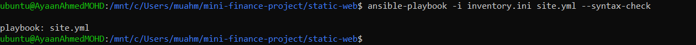

# Task 7 — Run the Multi-Play Playbook

## Goal

Install Nginx, deploy the website, and verify both servers in one playbook run.

## Evidence

### Screenshot 6 — Play 3 verification showing HTTP `200` for both servers

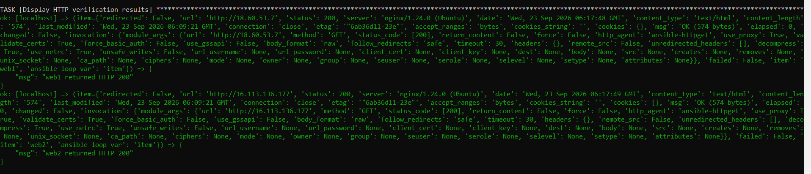

### Screenshot 7 — Final play recap showing `unreachable=0` and `failed=0` for `web1`, `web2`, and `localhost`

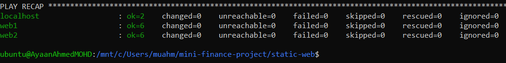

# Task 8 — Verify Idempotency

## Goal

Run the playbook again and confirm that it does not make unnecessary changes.

## Evidence

### Screenshot 8 — Second playbook run showing the play recap with `changed=0`, `unreachable=0`, and `failed=0` for both web servers

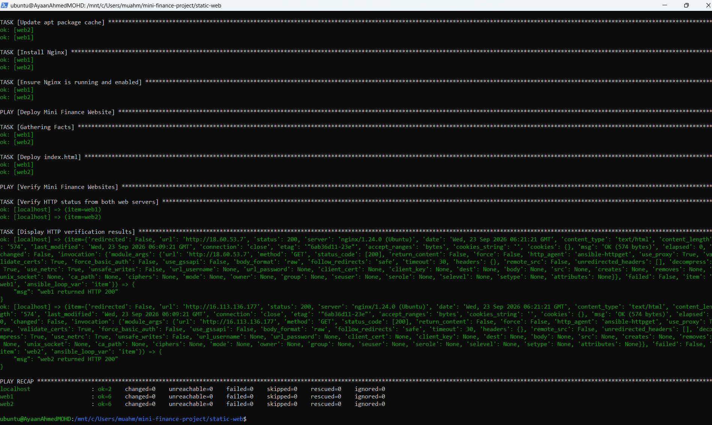

# Task 9 — Test Both Websites Manually

## Goal

Confirm that the static website is accessible from both public IP addresses.

## Evidence

### Screenshot 9 — `curl -I` output showing HTTP `200 OK` from both servers

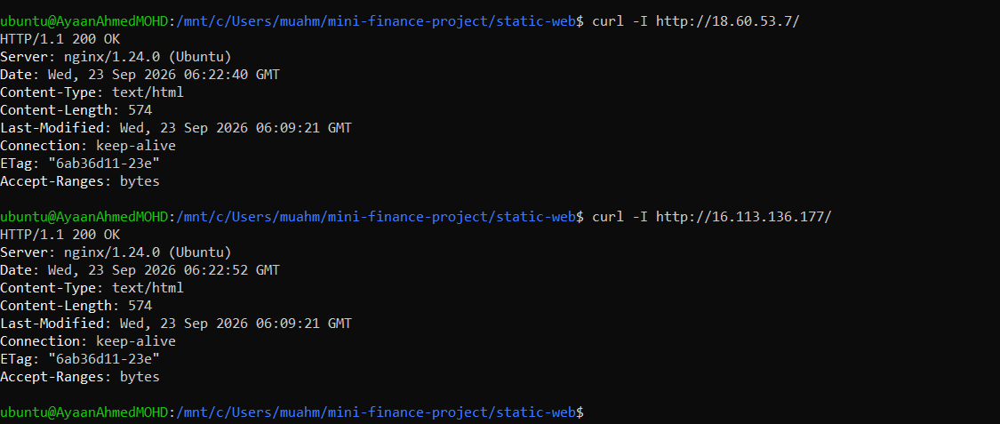

### Screenshot 10 — Browser showing the website from Server 1 with the public IP and your full name visible

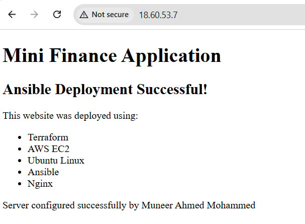

### Screenshot 11 — Browser showing the website from Server 2 with the public IP and your full name visible

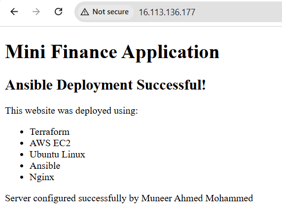

## Website URLs

Add both deployed website URLs below:

```text
Server 1: http://18.60.53.7/
Server 2: http://16.113.136.177/
```

---

# Task 10 — Complete the Project README

## Goal

Document how the project works and record what you learned.

## README Content

Copy and paste the complete contents of your `README.md` file below:

```markdown
# Mini Finance - Terraform and Ansible Deployment

## Project Overview

This project demonstrates the deployment and configuration of two Ubuntu web servers on AWS using Terraform and Ansible.

The infrastructure is provisioned using Terraform, while Ansible is used to configure Nginx and deploy a static Mini Finance website to both servers.

## Architecture

```text
                    Windows 11
                        |
                 WSL Ubuntu
                        |
                     Ansible
                        |
              +---------+---------+
              |                   |
              v                   v
          AWS EC2 web1        AWS EC2 web2
          18.60.53.7          16.113.136.177
              |                   |
              v                   v
            Nginx               Nginx
              |                   |
              +---------+---------+
                        |
                   Static Website
```

---

# LinkedIn Post Required

## Evidence

### LinkedIn Post URL

Paste your LinkedIn post URL here:

https://lnkd.in/p/dmdVdrw4

---

### Screenshot — Published LinkedIn post

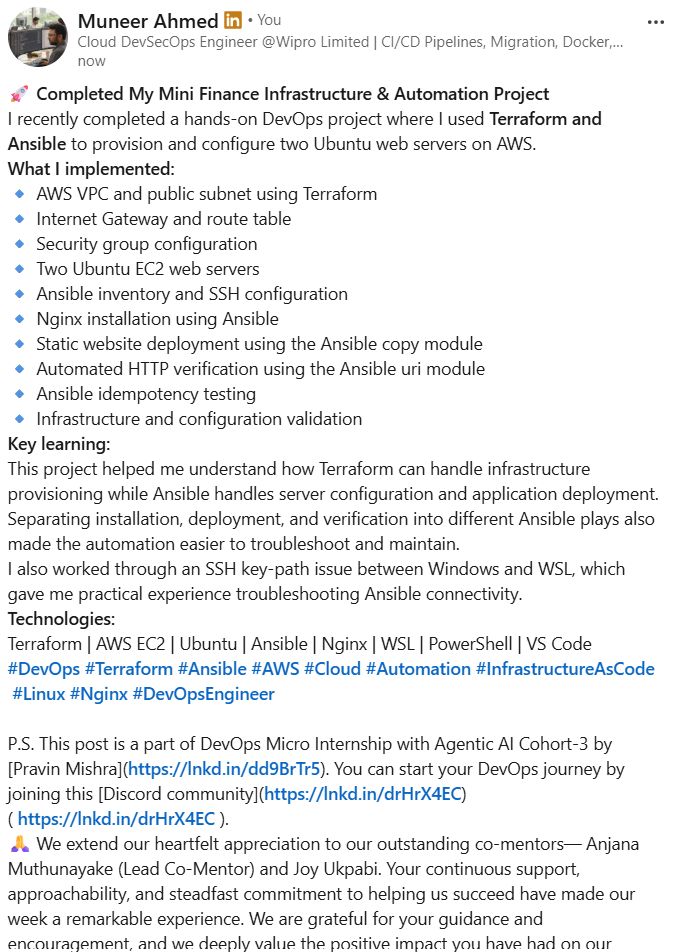

# Assignment Questions

Answer the following in your own words:

**1. What issue did you face while completing this assignment, and how did you fix it?**

One issue I faced was configuring the SSH private key path correctly for Ansible. I was running Ansible from WSL, while the SSH key was initially stored in my Windows user directory. Ansible was unable to find the key and returned a No such file or directory and Permission denied (publickey) error.

I fixed this by copying the private key into the WSL ~/.ssh directory, setting the correct permissions using chmod 600, and updating inventory.ini with the correct WSL key path. After that, I tested the connection using ansible web -i inventory.ini -m ping, and both web1 and web2 returned pong.

**2. What did you learn from this assignment?**

I learned how to provision AWS infrastructure using Terraform and then use Ansible to configure the servers. I learned how to create a VPC, subnet, security group, Internet Gateway, and two Ubuntu EC2 instances with Terraform. I also learned how to configure an Ansible inventory, connect to remote servers using SSH, install Nginx, deploy a static website, and verify the application using Ansible.

I also learned the importance of idempotency and separating infrastructure provisioning from server configuration.

**3. Why is it useful to split installation, deployment, and verification into separate plays?**

Splitting installation, deployment, and verification into separate plays makes the playbook easier to understand, troubleshoot, and maintain. Each play has a specific responsibility. The first play prepares the servers and installs Nginx, the second play deploys the website, and the third play verifies that the websites are responding correctly.

If something fails, I can quickly identify which stage caused the problem instead of troubleshooting one large set of tasks.

**4. What is one benefit of using the Ansible `copy` module instead of cloning the website directly from Git on every managed server?**

The copy module allows me to keep the website content in the Ansible project and deploy the same known version of the files to all managed servers. This avoids requiring Git or repository access on every server and gives Ansible direct control over the files being deployed.

**5. What does idempotency mean in this assignment?**

Idempotency means that I can run the same Ansible playbook multiple times and, after the desired configuration has already been applied, Ansible will not make unnecessary changes. For example, if Nginx is already installed and the correct index.html is already deployed, running the playbook again should show changed=0 for those tasks.

**6. What does the Ansible `uri` module verify in Play 3?**

The uri module in Play 3 verifies that the deployed websites are accessible over HTTP. It sends an HTTP request to each web server and checks that the server returns HTTP status code 200. This confirms that the Nginx web servers are reachable and that the website is responding successfully.

# Required Files

Confirm that the following files are included in your assignment folder:

- [x] `inventory.ini`
- [x] `site.yml`
- [x] `files/index.html`
- [x] `README.md`

---

# Submission Instructions

- Add all required screenshots in the correct order.
- Full Name must be visible in required screenshots.
- Include both deployed website URLs.
- Paste `inventory.ini`, `site.yml`, and `README.md` as editable text.
- Answer all assignment questions clearly in your own words.
- Add your LinkedIn post URL.
- Do not expose SSH private keys, passwords, cloud account IDs, or other sensitive information.

---

# Completion Checklist

- [x] Task 1: `static-web` folder structure is complete
- [x] Task 2: Both servers are listed under the `[web]` group in `inventory.ini`
- [x] Task 2: Inventory graph shows `web1` and `web2`
- [x] Task 3: Ansible ping returns `SUCCESS` and `pong` for both servers
- [x] Task 4: `files/index.html` contains your full name
- [x] Task 5: `site.yml` contains three separate plays
- [x] Task 5: Play 1 installs, starts, and enables Nginx
- [x] Task 5: Play 2 deploys `index.html` using the `copy` module
- [x] Task 5: Nginx reload handler is included
- [x] Task 5: Play 3 verifies both web servers from the controller
- [x] Task 6: Playbook syntax check passes
- [x] Task 7: First playbook run completes with `unreachable=0` and `failed=0`
- [x] Task 7: URI verification returns HTTP `200` for both servers
- [x] Task 8: Second playbook run demonstrates idempotency
- [x] Task 8: Second run shows `changed=0` for both web servers
- [x] Task 9: Both `curl -I` commands return HTTP `200 OK`
- [x] Task 9: Website loads from Server 1
- [x] Task 9: Website loads from Server 2
- [x] Task 9: Full name is visible on both deployed websites
- [x] Task 10: `README.md` contains all required explanations
- [x] Screenshots 1–11 are included
- [x] `inventory.ini`, `site.yml`, and `README.md` are pasted as editable text
- [x] Both website URLs are included
- [x] Assignment questions are answered
- [x] LinkedIn post published
- [x] LinkedIn post URL added
- [x] No sensitive information is exposed

---

## About DMI & CloudAdvisory

DevOps Micro Internship (DMI) is a project-based DevOps program run by Pravin Mishra and The CloudAdvisory, focused on real-world execution, systems thinking, and career readiness.

It helps learners build strong DevOps foundations with hands-on experience.

---

## Resources

- DMI Official Website: [https://dmi.pravinmishra.com?utm_source=github&utm_medium=readme](https://dmi.pravinmishra.com?utm_source=github&utm_medium=readme)
- University: [https://university.pravinmishra.com?utm_source=github&utm_medium=readme](https://university.pravinmishra.com?utm_source=github&utm_medium=readme)
- Discord Community: [https://discord.pravinmishra.com?utm_source=github&utm_medium=readme](https://discord.pravinmishra.com?utm_source=github&utm_medium=readme)
- Blog: [https://dmi.pravinmishra.com/blog?utm_source=github&utm_medium=readme](https://dmi.pravinmishra.com/blog?utm_source=github&utm_medium=readme)
- YouTube Playlist: [https://www.youtube.com/playlist?list=PLFeSNDtI4Cho](https://www.youtube.com/playlist?list=PLFeSNDtI4Cho)
- Pravin Mishra LinkedIn: [https://www.linkedin.com/in/pravin-mishra-aws-trainer/](https://www.linkedin.com/in/pravin-mishra-aws-trainer/)
- CloudAdvisory LinkedIn: [https://www.linkedin.com/company/thecloudadvisory/](https://www.linkedin.com/company/thecloudadvisory/)

---

*This submission is part of DevOps Micro Internship (DMI) — Agentic AI Track.*