# Assignment 04 — Deploy Mini Finance on Azure Using Terraform and Ansible

Part of the DevOps Micro Internship (DMI) with Agentic AI

---

## Purpose

In this assignment, you will provision Azure infrastructure using Terraform and deploy the Mini Finance website using an Ansible multi-play playbook.

Terraform will create the Azure Virtual Machine and networking resources. Ansible will install Nginx, clone the Mini Finance repository, deploy the website, and verify the deployment.

---

# Task 1 — Create the Project Structure

## Goal

Create separate directories and files for the Terraform infrastructure and Ansible configuration.

### Evidence

#### Screenshot 1 — Terminal or VS Code showing the complete `mini-finance` project structure

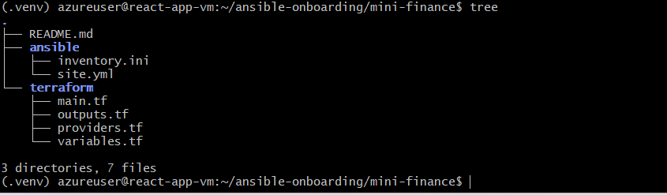

### Notes

### Task Notes

- Created the Mini Finance project structure with Terraform and Ansible.
- Created AWS infrastructure using Terraform, including the VPC, subnet, security group, route table, and two Ubuntu EC2 instances.
- Configured the two EC2 servers as Ansible managed nodes.
- Set up an Ansible control environment using a Python virtual environment.
- Created an Ansible inventory containing both web servers.
- Used Ansible to verify connectivity to both servers.
- Installed and configured Nginx on the servers using Ansible.
- Deployed the Mini Finance static website using the Ansible playbook.
- Verified that the website was accessible from both EC2 public IP addresses.
- Added my full name to the deployed website as required by the assignment.
- Verified Ansible playbook idempotency by running the playbook again and checking that no unnecessary changes were made.
- Used Ansible verification tasks to confirm successful HTTP responses from the web servers.
- Documented the project structure, deployment process, issues encountered, and lessons learned in the README.

# Task 2 — Create the Azure Infrastructure Using Terraform

## Goal

Use Terraform to provision an Ubuntu Virtual Machine with the required Azure networking and security resources.

### Evidence

#### Screenshot 2 — Terraform code showing the `Allow-SSH` rule for port `22` and the `Allow-HTTP` rule for port `80`

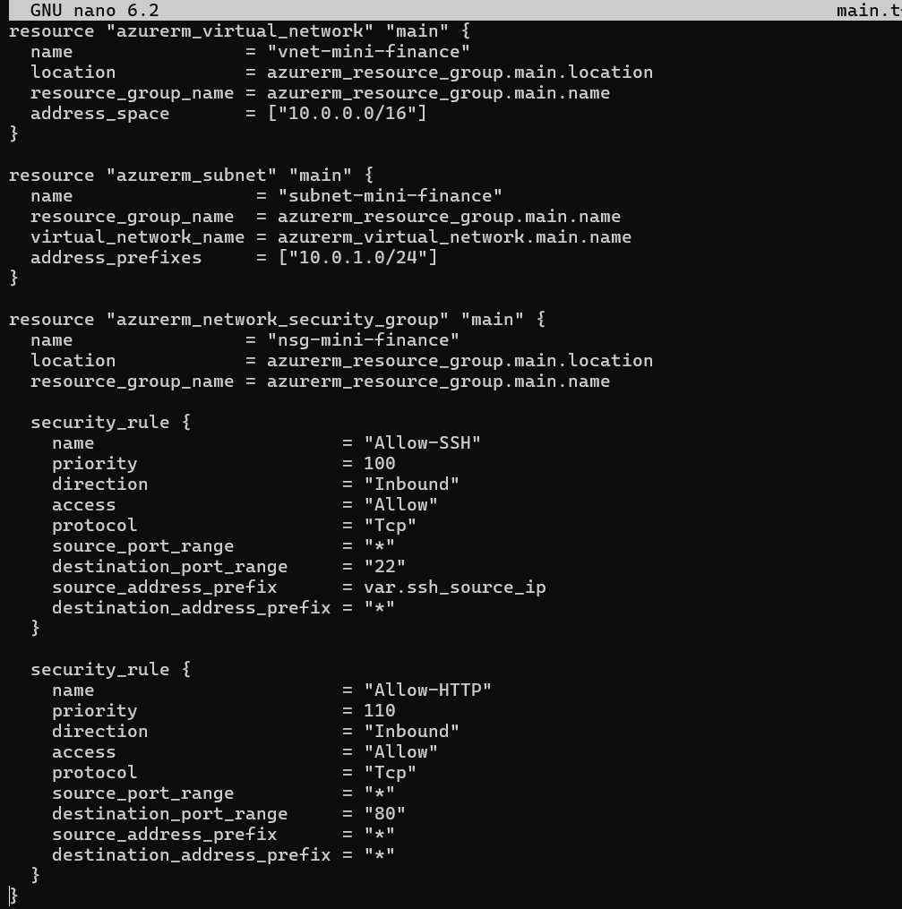

#### Screenshot 3 — Terraform code showing the association between `nsg-mini-finance` and `nic-mini-finance`

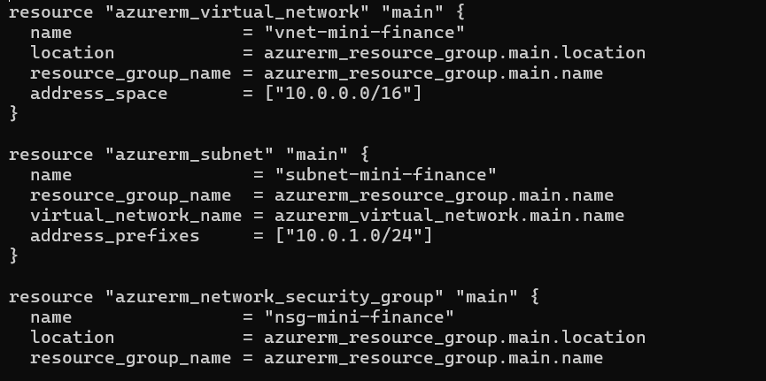

### Notes

Created the Azure infrastructure using Terraform with the AzureRM provider.
Configured an Azure Resource Group, Virtual Network, Subnet, Network Security Group (NSG), Network Interface (NIC), and Ubuntu Virtual Machine.
Created the nsg-mini-finance Network Security Group and configured the required inbound security rules:
Allow-SSH — TCP port 22 for SSH access.
Allow-HTTP — TCP port 80 for HTTP access.
Associated nsg-mini-finance with nic-mini-finance to apply the network security rules to the VM's network interface.

# Task 3 — Initialize and Apply the Terraform Configuration

## Goal

Format and validate the Terraform configuration, review the execution plan, and provision the Azure infrastructure.

### Evidence

#### Screenshot 4 — End of the `terraform apply` output showing `Apply complete!` with no errors

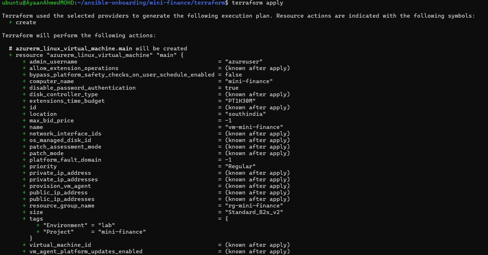
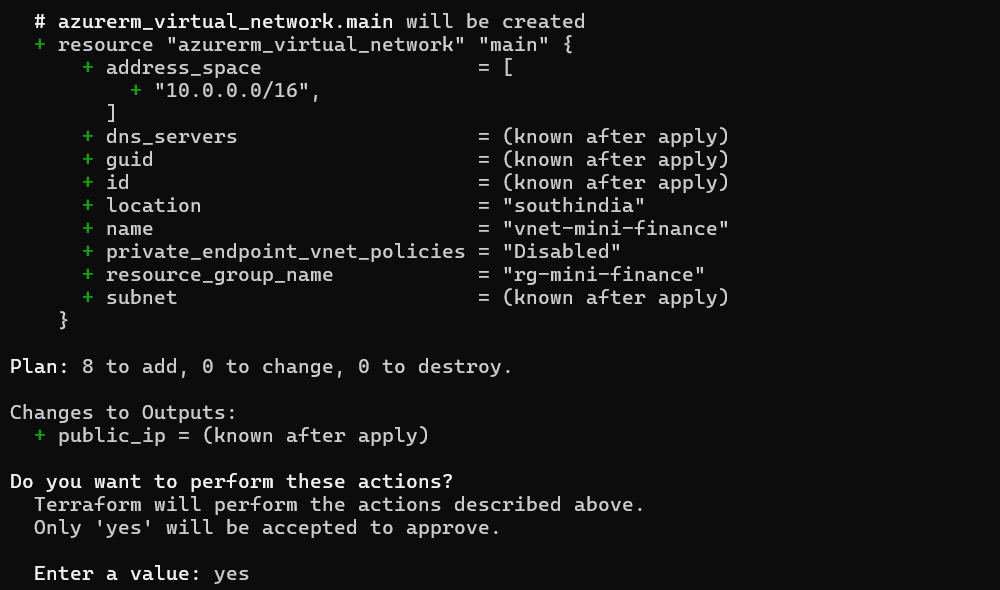

#### Screenshot 5 — Output of `terraform output public_ip` showing the VM’s public IP address

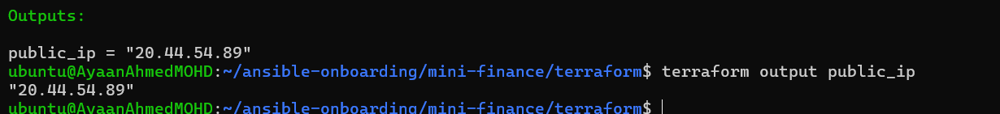

### Notes

Created the Azure infrastructure using Terraform.
Configured the Azure Resource Group, Virtual Network, Subnet, Network Security Group, NIC, and Ubuntu VM.
Added NSG rules to allow SSH (port 22) and HTTP (port 80) traffic.
Associated the nsg-mini-finance NSG with nic-mini-finance.
Configured SSH key-based authentication for the Ubuntu VM.
Verified the available Ubuntu image in the South India region and corrected the image SKU to 22_04-lts.
Ran Terraform formatting and validation before deployment.
Used terraform plan to review the infrastructure changes before applying them.

# Task 4 — Verify Passwordless SSH Access

## Goal

Confirm that the Ansible controller can connect to the Terraform-provisioned Azure VM using SSH key authentication.

### Evidence

#### Screenshot 6 — Passwordless SSH command and the returned `mini-finance` hostname

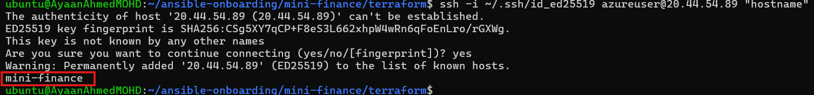

### Notes

Successfully retrieved the Azure VM public IP: 20.44.54.89.
Connected from the Ansible controller (WSL Ubuntu) to the Azure VM using SSH key authentication.
Used the private key ~/.ssh/id_ed25519.
Confirmed the VM hostname returned successfully as:
mini-finance
During the first connection, accepted the SSH host fingerprint using yes.
Confirmed that SSH connected without requesting the azureuser password.
This verifies that passwordless SSH key authentication is working correctly between the Ansible controller and the Terraform-provisioned Azure VM.
The SSH connection was tested from the controller, as required by the assignment.

# Task 5 — Create the Ansible Inventory and Verify Connectivity

## Goal

Add the Terraform-provisioned Azure VM to the Ansible inventory and confirm that Ansible can connect to it.

### Evidence

#### Screenshot 7 — Ansible ping output showing `SUCCESS` and `pong` from the Azure VM

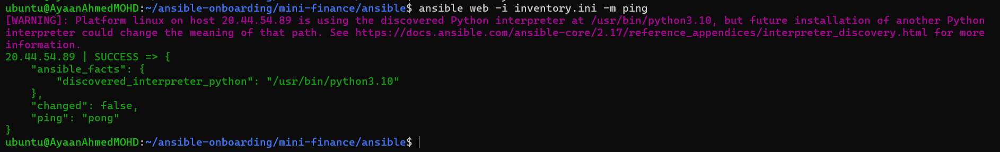

### Configuration File

Copy and paste the complete contents of your `ansible/inventory.ini` file below:

```ini

[web]
20.44.54.89

[web:vars]
ansible_user=azureuser
ansible_ssh_private_key_file=~/.ssh/id_ed25519

```

---

# Task 6 — Create the Multi-Play Ansible Playbook

## Goal

Create one Ansible playbook containing separate plays to install Nginx, deploy the Mini Finance website, and verify the deployment.

### Evidence

#### Screenshot 8 — `site.yml` showing Play 1 and the beginning of Play 2

Screenshot must show:

- Play 1 targeting the `web` group
- Installation of `nginx`, `git`, and `rsync`
- Nginx service configured as started and enabled
- Beginning of Play 2 with the Git repository URL and synchronization task

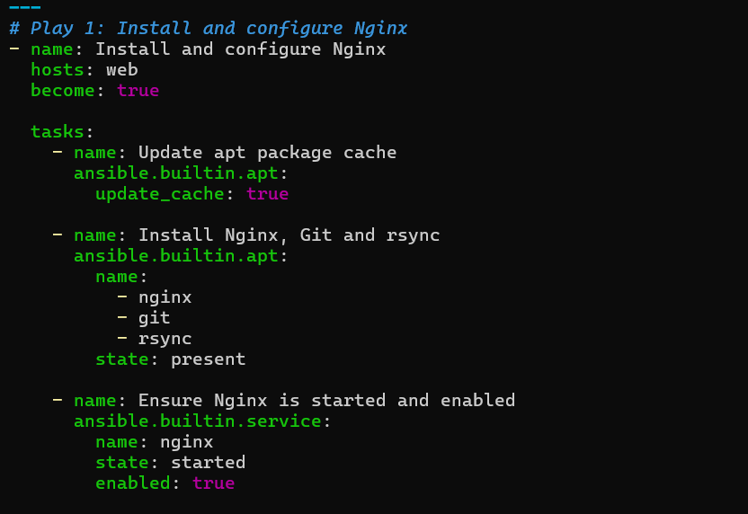
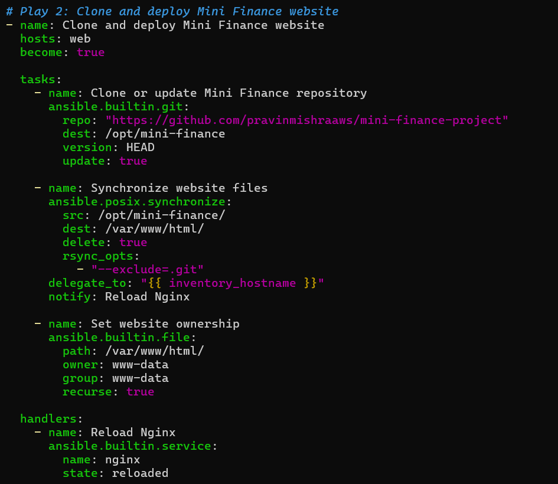

#### Screenshot 9 — `site.yml` showing the deployment destination, handler, and Play 3 verification

Screenshot must show:

- Website destination `/var/www/html/`
- Ownership set to `www-data:www-data`
- Nginx reload handler
- Play 3 targeting `localhost`
- The `uri` verification and `assert` condition

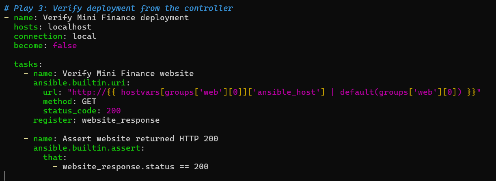

### Configuration File

Copy and paste the complete contents of your `ansible/site.yml` file below:

```yaml

---
# Play 1: Install and configure Nginx
- name: Install and configure Nginx
  hosts: web
  become: true

  tasks:
    - name: Update apt package cache
      ansible.builtin.apt:
        update_cache: true

    - name: Install Nginx, Git and rsync
      ansible.builtin.apt:
        name:
          - nginx
          - git
          - rsync
        state: present

    - name: Ensure Nginx is started and enabled
      ansible.builtin.service:
        name: nginx
        state: started
        enabled: true


# Play 2: Clone and deploy Mini Finance website
- name: Clone and deploy Mini Finance website
  hosts: web
  become: true

  tasks:
    - name: Clone or update Mini Finance repository
      ansible.builtin.git:
        repo: "https://github.com/pravinmishraaws/mini_finance"
        dest: /opt/mini-finance
        version: HEAD
        update: true

    - name: Synchronize website files
      ansible.posix.synchronize:
        src: /opt/mini-finance/
        dest: /var/www/html/
        delete: true
        rsync_opts:
          - "--exclude=.git"
      delegate_to: "{{ inventory_hostname }}"
      notify: Reload Nginx

    - name: Set website ownership
      ansible.builtin.file:
        path: /var/www/html/
        owner: www-data
        group: www-data
        recurse: true

  handlers:
    - name: Reload Nginx
      ansible.builtin.service:
        name: nginx
        state: reloaded


# Play 3: Verify deployment from the controller
- name: Verify Mini Finance deployment
  hosts: localhost
  connection: local
  become: false

  tasks:
    - name: Verify Mini Finance website
      ansible.builtin.uri:
        url: "http://{{ hostvars[groups['web'][0]]['ansible_host'] | default(groups['web'][0]) }}"
        method: GET
        status_code: 200
      register: website_response

    - name: Assert website returned HTTP 200
      ansible.builtin.assert:
        that:
          - website_response.status == 200

```

---

# Task 7 — Validate and Run the Ansible Playbook

## Goal

Validate the syntax of the multi-play Ansible playbook and run it to install Nginx, deploy the Mini Finance website, and verify the deployment.

### Evidence

#### Screenshot 10 — Successful playbook syntax check showing `playbook: site.yml`

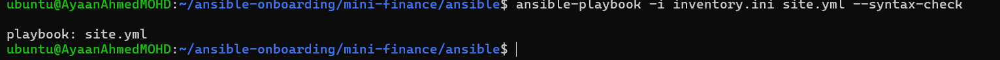

#### Screenshot 11 — Play 3 output showing the successful HTTP verification and assertion

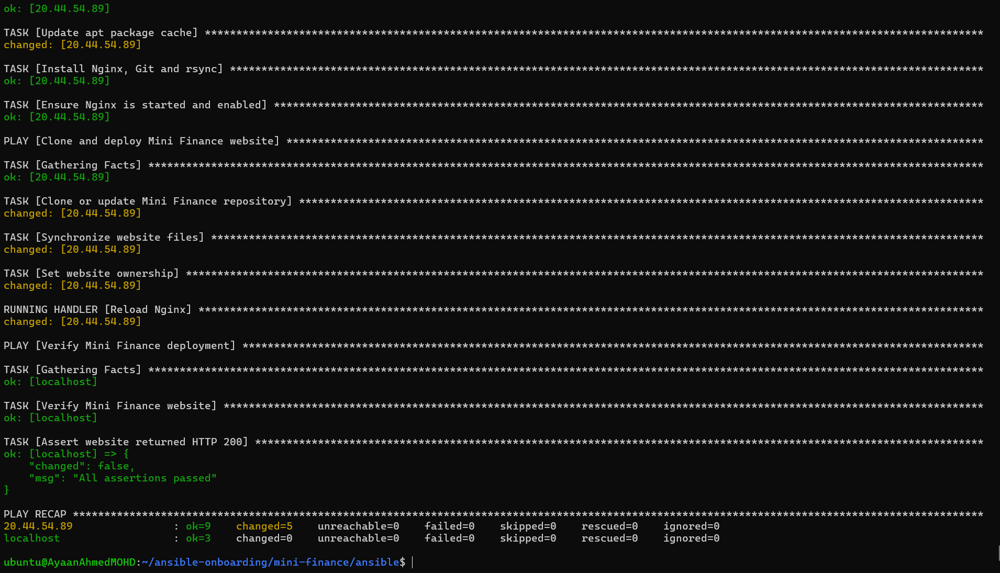

#### Screenshot 12 — Final `PLAY RECAP` showing `failed=0` and `unreachable=0`

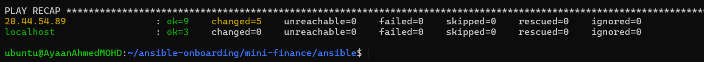

### Notes

- Validated the Ansible playbook syntax successfully using the syntax-check command.
- Executed the multi-play Ansible playbook from the ansible directory.
- Installed and configured Nginx, Git, and rsync on the Azure VM.
- Confirmed that Nginx was started and enabled.
- Cloned the Mini Finance repository and deployed the website files to /var/www/html/.
- Reloaded Nginx after the website deployment.
- Verified the Mini Finance website from the Ansible controller.
- Confirmed that the website returned HTTP status code 200.
- The final assertion completed successfully with "All assertions passed".
- Final play recap showed failed=0 and unreachable=0.
- Successfully completed the Ansible deployment and verification workflow.

# Task 8 — Test the Mini Finance Website in a Browser

## Goal

Confirm that the Mini Finance website is publicly accessible through the Azure VM’s public IP address.

### Evidence

#### Screenshot 13 — Mini Finance website successfully loading in the browser, with the Azure VM’s public IP address visible in the address bar

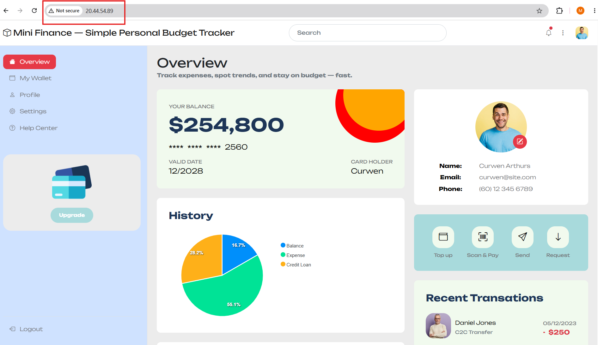

### Website URL

Add your deployed website URL below:

```text

http://20.44.54.89/

```

---

# Task 9 — Create the Project README

## Goal

Create a `README.md` file to document the Mini Finance infrastructure and deployment project.

### Evidence

#### Screenshot 14 — Completed `README.md` displayed in the VS Code Markdown preview or terminal

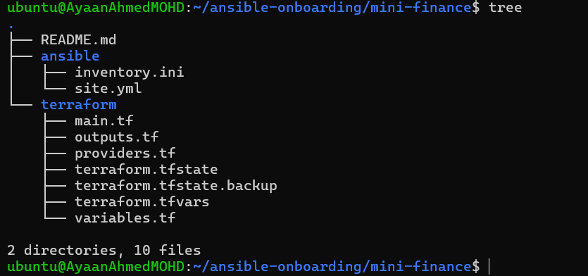

### README Content

Copy and paste the complete contents of your `README.md` file below:

```markdown

# Mini Finance — Azure Infrastructure and Ansible Deployment

## Project Objective

The objective of this project is to provision an Ubuntu Virtual Machine in Microsoft Azure using Terraform and deploy the Mini Finance website using Ansible.

This project demonstrates Infrastructure as Code with Terraform, configuration management and application deployment with Ansible, and web server configuration using Nginx.

## Tools and Technologies

- Terraform
- Microsoft Azure
- Ansible
- Nginx
- Git
- rsync
- Ubuntu Linux

## Infrastructure Created

The following Azure infrastructure was created:

- Resource Group
- Virtual Network
- Subnet
- Network Security Group
- Public IP Address
- Network Interface
- Ubuntu Virtual Machine

The Azure VM is accessed securely from the Ansible controller using SSH key-based authentication.

## Ansible Deployment Workflow

The deployment was automated using an Ansible multi-play playbook.

### Play 1 — Install and Configure Nginx

- Updated the APT package cache.
- Installed Nginx, Git, and rsync.
- Started and enabled the Nginx service.

### Play 2 — Deploy Mini Finance Website

- Cloned the Mini Finance Git repository.
- Synchronized the website files to `/var/www/html/`.
- Set the website file ownership to `www-data`.
- Reloaded Nginx after deployment changes.

### Play 3 — Verify Deployment

- Verified the Mini Finance website from the Ansible controller.
- Confirmed that the website returned HTTP status code `200`.
- Used an Ansible assertion to confirm successful deployment.

## Verification

The deployment was verified in two ways:

1. Ansible performed an HTTP request against the deployed website.
2. The website was accessed through a web browser using the Azure VM public IP address.

The Ansible verification completed successfully with:

- HTTP status code: `200`
- Assertion: `All assertions passed`
- Failed tasks: `0`
- Unreachable hosts: `0`

## Challenge and Solution

One challenge during the deployment was the Git repository URL used in the Ansible playbook.

The original repository URL did not successfully provide the expected repository. Connectivity to GitHub was tested from the Azure VM using `git ls-remote`.

The repository URL was corrected to:

`https://github.com/pravinmishraaws/mini_finance`

After correcting the repository URL, the Ansible playbook successfully cloned the repository and completed the website deployment.

## What I Learned

This project helped me understand how Terraform and Ansible can be used together.

Terraform was used to provision the Azure infrastructure, while Ansible was used to configure the VM and automate the application deployment.

I also practiced:

- SSH key-based authentication
- Ansible inventory management
- Ansible playbooks and handlers
- Nginx configuration
- Git repository deployment
- rsync-based file synchronization
- Automated HTTP verification
- Terraform and Ansible infrastructure automation

## Deployment Result

The Mini Finance website was successfully deployed to the Azure Ubuntu Virtual Machine and verified using Ansible with HTTP status code `200`.

```

---

# LinkedIn Post Required

## Evidence

#### Screenshot 15 — Published LinkedIn post showing the text and at least one deployment screenshot

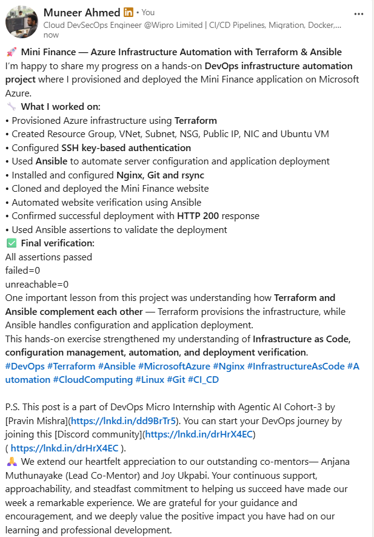

#### LinkedIn Post URL

Paste your LinkedIn post URL here:

https://lnkd.in/p/dk8JQFvj

---

### LinkedIn Submission Notes

**One challenge you faced and how you fixed it:**

One challenge I faced was that the Git repository URL configured in the Ansible playbook was not the correct repository URL. I first tested GitHub connectivity from the Azure VM and confirmed that GitHub was reachable. I then used git ls-remote to verify the correct repository and updated the Ansible playbook to use https://github.com/pravinmishraaws/mini_finance. After making the change, the Ansible playbook successfully cloned the repository and deployed the website.

**One real-world example where you can use this learning:**

This approach can be used in a real-world DevOps environment to automatically provision servers using Terraform and then configure and deploy applications using Ansible. For example, when a company needs multiple web servers, Terraform can create the Azure infrastructure while Ansible can install Nginx, deploy the application, configure the servers, and verify that the application is working.

# Assignment Questions

Answer the following in your own words:

**1. What did you provision using Terraform in this assignment?**

I used Terraform to provision the Azure infrastructure required for the Mini Finance application. This included the Resource Group, Virtual Network, Subnet, Network Security Group, Public IP address, Network Interface, and Ubuntu Virtual Machine.

**2. What did Ansible configure and deploy in this assignment?**

Ansible configured the Ubuntu VM by installing and configuring Nginx, Git, and rsync. It then cloned the Mini Finance repository, synchronized the website files to /var/www/html/, set the appropriate ownership, reloaded Nginx, and verified the deployed website.

**3. Why is SSH access on port `22` restricted to your public IP address?**

SSH port 22 is restricted to the administrator's public IP address so that only an authorized network location can attempt to connect to the server. This reduces exposure to unwanted SSH connection attempts from the public internet and follows the principle of limiting access to only what is required.

**4. Why is HTTP port `80` open to the internet?**

HTTP port 80 is open because the Mini Finance website needs to be accessible through a web browser from the internet. Opening port 80 allows users to send HTTP requests to the Nginx web server running on the Azure VM.

**5. What is the purpose of the Ansible inventory file?**

The Ansible inventory file tells Ansible which servers it should manage and provides connection information for those servers. In this assignment, the inventory identifies the Azure VM under the web group and provides the VM's IP address, SSH user, and private key used for authentication.

**6. Why does the playbook use separate plays for install, deploy, and verify?**

The playbook uses separate plays to keep different responsibilities organized.

The first play installs and configures Nginx and required packages.
The second play deploys the Mini Finance website.
The third play verifies the deployment from the Ansible controller.

This makes the automation easier to understand, maintain, troubleshoot, and reuse. The assignment specifically structures the workflow around installation, deployment, and verification.

**7. Why is `rsync` useful when deploying website files?**

rsync is useful because it efficiently synchronizes files between locations and can copy only the files that need to be updated. In this assignment, it is used to synchronize the Mini Finance website files into /var/www/html/, making the deployment process automated and repeatable.

**8. What does the Ansible `uri` module verify in this assignment?**

The Ansible uri module sends an HTTP request to the deployed Mini Finance website and verifies that the website responds with HTTP status code 200. An assertion is then used to confirm that the expected status was returned.

**9. What issue did you face during this assignment, and how did you fix it?**

I faced an issue where the Ansible Git task was not progressing while trying to clone the Mini Finance repository. I tested connectivity to GitHub from the Azure VM and confirmed that GitHub was reachable. I then used git ls-remote to check the repository and identified that the repository URL needed to be corrected. After updating the repository URL in site.yml, the playbook successfully cloned the repository and completed the deployment.

**10. What did you learn from using Terraform and Ansible together?**

I learned that Terraform and Ansible can complement each other in an Infrastructure as Code workflow. Terraform can be used to provision the required Azure infrastructure, while Ansible can configure the provisioned server, install software, deploy the application, and verify the result. This separates infrastructure provisioning from server configuration and application deployment and makes the overall process more automated and repeatable.

# Required Files

Confirm that the following files are included in your assignment folder:

- [x] `.gitignore`
- [x] `README.md`
- [x] `terraform/providers.tf`
- [x] `terraform/main.tf`
- [x] `terraform/variables.tf`
- [x] `terraform/outputs.tf`
- [x] `ansible/inventory.ini`
- [x] `ansible/site.yml`

---

# Submission Instructions

- Add all required screenshots in the correct order.
- Full Name must be visible in required screenshots.
- Add the Azure VM public IP address.
- Add the final Mini Finance website URL.
- Paste `inventory.ini`, `site.yml`, and `README.md` as editable text.
- Answer all assignment questions clearly in your own words.
- Add your LinkedIn post URL.
- Do not expose SSH private keys, passwords, Azure credentials, subscription IDs, Terraform state contents, or other sensitive information.

---

# Completion Checklist

- [x] Task 1: `mini-finance` project structure created
- [x] Task 1: `.gitignore` created
- [x] Task 2: Terraform Azure infrastructure code created
- [x] Task 2: `Allow-SSH` rule configured for port `22`
- [x] Task 2: `Allow-HTTP` rule configured for port `80`
- [x] Task 2: NSG associated with the Network Interface
- [x] Task 3: `terraform fmt` completed
- [x] Task 3: `terraform init` completed
- [x] Task 3: `terraform validate` completed successfully
- [x] Task 3: `terraform apply` completed successfully
- [x] Task 3: `terraform output public_ip` displayed the VM public IP
- [x] Task 4: Passwordless SSH works from the Ansible controller
- [x] Task 5: `inventory.ini` created
- [x] Task 5: Ansible ping returns `SUCCESS` and `pong`
- [x] Task 6: `site.yml` contains three separate plays
- [x] Task 6: Play 1 installs Nginx, Git, and rsync
- [x] Task 6: Play 2 clones and deploys the Mini Finance website
- [x] Task 6: Play 3 verifies HTTP status code `200`
- [x] Task 7: Playbook syntax check passes
- [x] Task 7: Ansible playbook completes successfully
- [x] Task 7: Final recap shows `failed=0` and `unreachable=0`
- [x] Task 8: Mini Finance website loads in the browser
- [x] Task 8: Azure VM public IP is visible in the browser screenshot
- [x] Task 9: `README.md` completed
- [x] Screenshots 1–15 are included
- [x] `inventory.ini`, `site.yml`, and `README.md` are pasted as editable text
- [x] Assignment questions are answered
- [x] LinkedIn post published with Anyone visibility
- [x] LinkedIn post URL added
- [x] No sensitive information is exposed

---

## About DMI & CloudAdvisory

DevOps Micro Internship (DMI) is a project-based DevOps program run by Pravin Mishra and The CloudAdvisory, focused on real-world execution, systems thinking, and career readiness.

It helps learners build strong DevOps foundations with hands-on experience.

---

## Resources

- DMI Official Website: [https://dmi.pravinmishra.com?utm_source=github&utm_medium=readme](https://dmi.pravinmishra.com?utm_source=github&utm_medium=readme)
- University: [https://university.pravinmishra.com?utm_source=github&utm_medium=readme](https://university.pravinmishra.com?utm_source=github&utm_medium=readme)
- Discord Community: [https://discord.pravinmishra.com?utm_source=github&utm_medium=readme](https://discord.pravinmishra.com?utm_source=github&utm_medium=readme)
- Blog: [https://dmi.pravinmishra.com/blog?utm_source=github&utm_medium=readme](https://dmi.pravinmishra.com/blog?utm_source=github&utm_medium=readme)
- YouTube Playlist: [https://www.youtube.com/playlist?list=PLFeSNDtI4Cho](https://www.youtube.com/playlist?list=PLFeSNDtI4Cho)
- Pravin Mishra LinkedIn: [https://www.linkedin.com/in/pravin-mishra-aws-trainer/](https://www.linkedin.com/in/pravin-mishra-aws-trainer/)
- CloudAdvisory LinkedIn: [https://www.linkedin.com/company/thecloudadvisory/](https://www.linkedin.com/company/thecloudadvisory/)

---

*This submission is part of DevOps Micro Internship (DMI) — Agentic AI Track.*