# Assignment — Deploy EpicBook with Terraform and Ansible Roles

Part of the DevOps Micro Internship (DMI) with Agentic AI

---

## Purpose

In this assignment, you will deploy the EpicBook web application using Terraform and Ansible roles.

Terraform provisions the cloud infrastructure, including one Ubuntu VM and one managed MySQL database. Ansible roles configure the VM, install required software, deploy the EpicBook application, configure Nginx, connect the app to the managed MySQL database, and verify the deployment.

---

# Task 1 — Set Up the Project Folder Layout

## Goal

Create the project folder structure for Terraform and Ansible roles.

Terraform will be used to provision the cloud infrastructure. Ansible roles will be used to configure the VM and deploy the EpicBook application.

### Evidence

#### Screenshot 1 — Terminal showing the completed `epicbook-prod` project structure

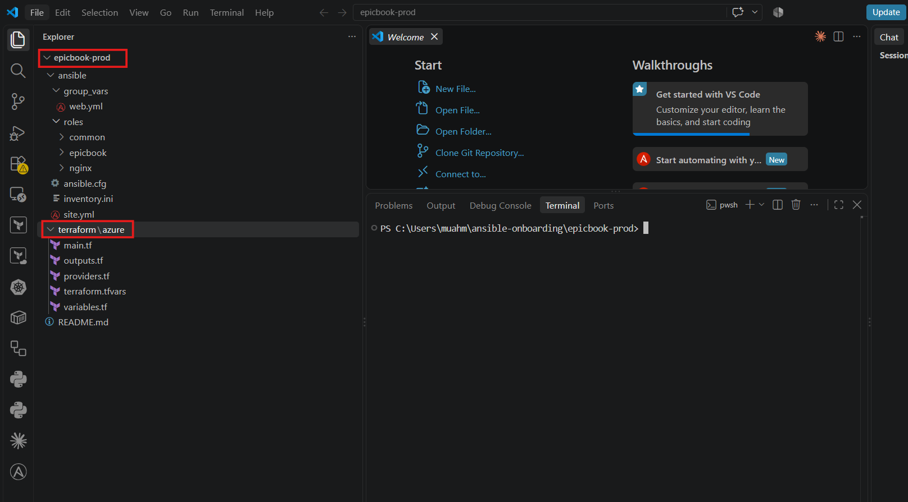

### Notes

Answer the following in your own words:

**1. Which cloud provider did you choose for this assignment?**

I chose Microsoft Azure as the cloud provider for this assignment. I used Terraform to define and manage the Azure infrastructure, while Ansible is used for configuring and managing the servers after they are provisioned.

**2. Why is it useful to keep Terraform files and Ansible files in separate folders?**

Keeping Terraform and Ansible files in separate folders makes the project organized and easier to manage. Terraform is mainly responsible for creating infrastructure, such as virtual machines, networks, and security resources, while Ansible is used for configuring the servers and deploying applications. Separating them also makes troubleshooting, maintenance, and future changes easier.

**3. What is the purpose of the `roles` directory in Ansible?**

The roles directory is used to organize Ansible automation into reusable components. Each role can handle a specific task, such as installing common packages, configuring Nginx, or deploying the EpicBook application. This keeps playbooks clean, makes the automation easier to understand, and allows the same configuration to be reused across different servers or projects.

# Task 2 — Provision the Infrastructure with Terraform

## Goal

Run Terraform to provision the cloud infrastructure for the EpicBook deployment.

Terraform will create the VM, managed MySQL database, networking, security rules, and required outputs.

### Evidence

#### Screenshot 2 — `terraform apply` completed successfully

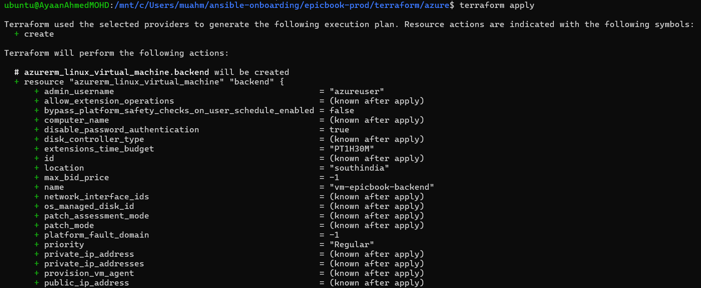
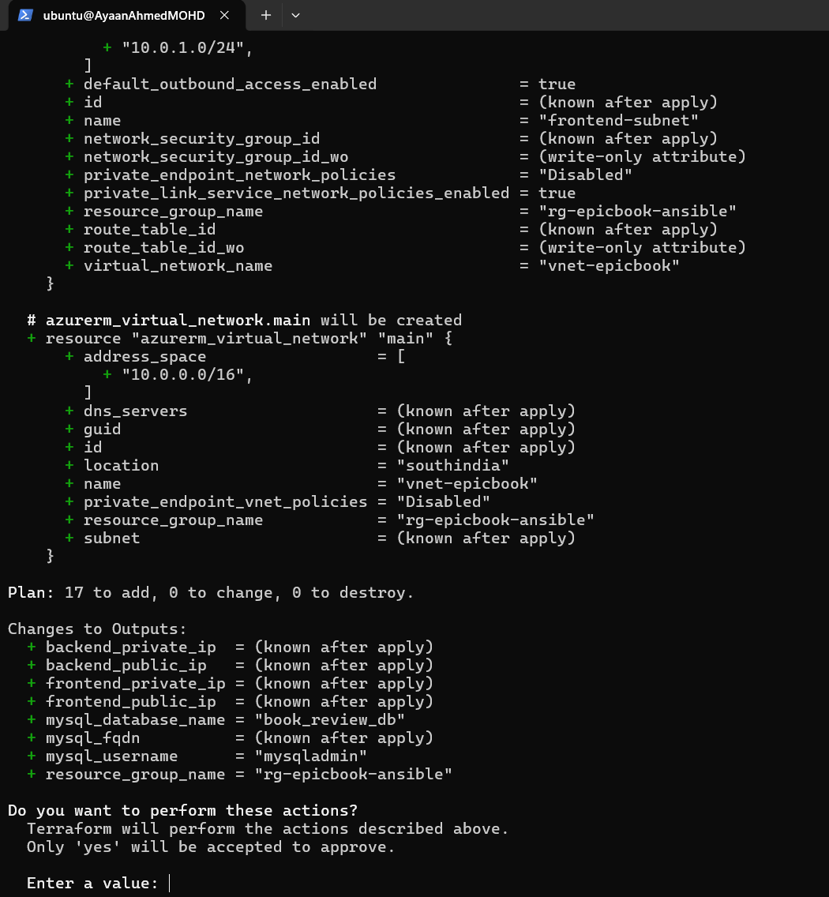

#### Screenshot 3 — Output of `terraform output`

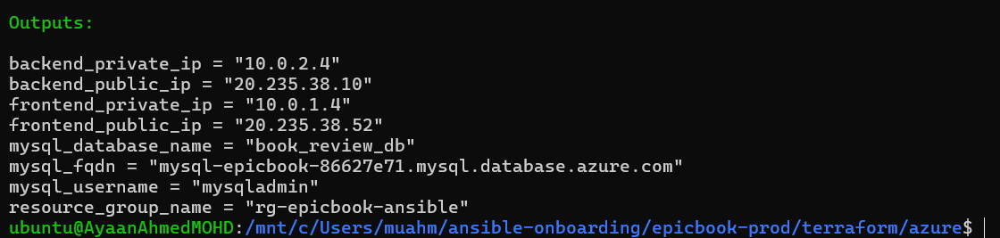

#### Screenshot 4 — Azure Portal or AWS Console showing the VM running

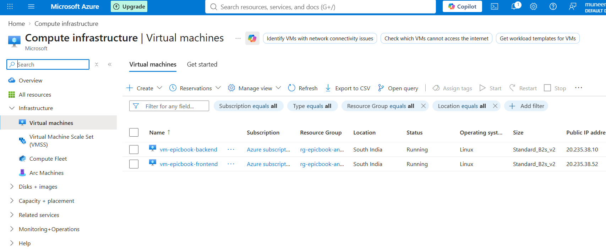

#### Screenshot 5 — Azure Portal or AWS Console showing the managed MySQL database created

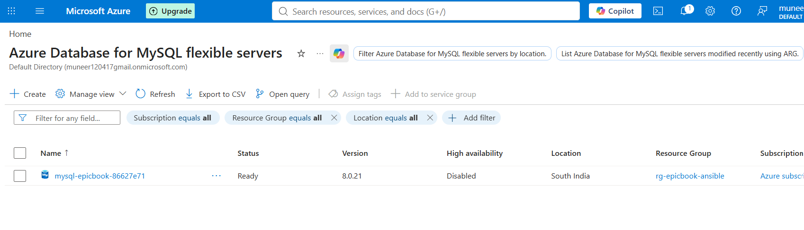

### Notes

Answer the following in your own words:

**1. What resources did Terraform create for this assignment?**

Terraform created the main Azure infrastructure required for the application. This included a Resource Group, Virtual Network, frontend and backend subnets, Network Security Groups, Public IP addresses, Network Interfaces, and an Azure MySQL Flexible Server with a database and firewall rule. The frontend and backend VMs were also defined in Terraform, but their creation failed because the selected Standard_B2s VM size was unavailable in the South India region.

**2. Why should you review `terraform plan` before running `terraform apply`?**

We should review terraform plan because it shows what Terraform is going to create, modify, or delete before making any changes. It helps us verify the resource configuration, detect mistakes, and avoid unexpected changes to the Azure environment. In this assignment, reviewing the plan also helped us understand the 17 resources Terraform intended to create.

**3. Why should database passwords not be shown in Terraform output?**

Database passwords are sensitive credentials. If they are displayed in Terraform output, logs, screenshots, Git repositories, or CI/CD systems, someone else could gain access to the database. Therefore, passwords should be stored securely, marked as sensitive in Terraform variables, and never committed to Git or exposed in Terraform output.

# Task 3 — Verify SSH Key-Based Access

## Goal

Verify that the cloud VM can be accessed from the Ansible controller using SSH key-based authentication.

### Evidence

#### Screenshot 6 — Successful SSH hostname check from the Ansible controller

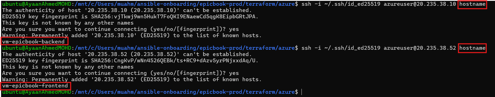

### Notes

Answer the following in your own words:

**1. What command did you use to verify SSH access?**

I used the SSH command from my Ansible controller to connect to the Azure VM:

ssh -i ~/.ssh/id_ed25519 azureuser@<VM_PUBLIC_IP> hostname

This connects to the VM using my SSH private key and displays the remote machine's hostname.

**2. What proves that SSH key-based access worked successfully?**

The successful connection without entering a password, along with the VM hostname being displayed, proves that the SSH key was accepted and I was able to access the Azure VM.

**3. What would you check if SSH returned `Permission denied (publickey)`?**

I would first check that I am using the correct private key and username. I would also verify that the matching public key is configured on the VM, port 22 is allowed by the Network Security Group, and the SSH service is running. I would use verbose SSH output to troubleshoot further:

ssh -v -i ~/.ssh/id_ed25519 azureuser@<VM_PUBLIC_IP>

# Task 4 — Create the Ansible Inventory and Configuration

## Goal

Create the Ansible inventory file and local Ansible configuration for the EpicBook VM.

The inventory tells Ansible which VM to manage and which SSH user to use.

### Evidence

#### Screenshot 7 — `inventory.ini` showing the VM under the `web` group

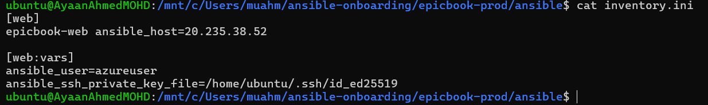

#### Screenshot 8 — Output of `ansible-inventory -i inventory.ini --graph`

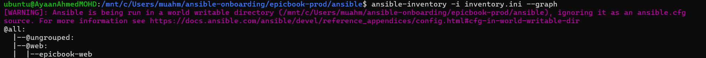

#### Screenshot 9 — Output of `ansible web -i inventory.ini -m ping`

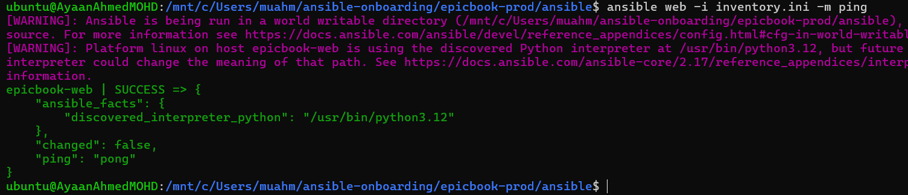

### Notes

Answer the following in your own words:

**1. What is the purpose of `inventory.ini`?**

inventory.ini tells Ansible which servers it needs to manage. It groups the servers and defines connection details such as the VM address and SSH user.

**2. What does `ansible_host` store?**

ansible_host stores the actual IP address or hostname that Ansible uses to connect to the target VM.

For example:

ansible_host=20.x.x.x

**3. What does `ansible_ssh_private_key_file` tell Ansible?**

ansible_ssh_private_key_file tells Ansible which SSH private key it should use when connecting to the remote VM.

In our lab:

ansible_ssh_private_key_file=/home/ubuntu/.ssh/id_ed25519

**4. Why is `host_key_checking = False` used only for this temporary lab?**

It disables SSH host-key verification so Ansible can connect to the newly created VM without asking for manual host-key confirmation. This makes the lab easier to automate, but it reduces SSH verification, so it should not normally be disabled in a production environment.

# Task 5 — Create the Main Ansible Playbook

## Goal

Create the main Ansible playbook that runs the required roles in the correct order.

The `site.yml` file will call the `common`, `nginx`, and `epicbook` roles.

### Evidence

#### Screenshot 10 — `site.yml` showing the roles in the correct order

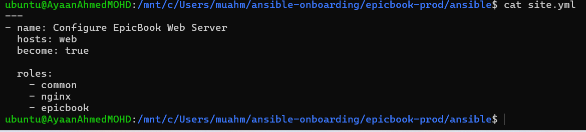

#### Screenshot 11 — Output of `ansible-playbook -i inventory.ini site.yml --syntax-check`

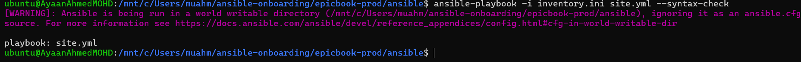

### Notes

Answer the following in your own words:

**1. What is the purpose of `site.yml`?**

site.yml is the main Ansible playbook that controls the configuration of the web server. It defines the target hosts, enables administrative privileges, and specifies which roles Ansible should execute.

**2. Why should the roles run in the order `common`, `nginx`, and `epicbook`?**

The common role should run first because it prepares the server with the required basic packages and configuration. The nginx role can then configure the web server and reverse proxy. Finally, the epicbook role deploys the application after the required server environment is ready.

**3. What does `become: true` allow Ansible to do?**

become: true allows Ansible to execute tasks with elevated privileges, normally through sudo. This is required for tasks such as installing packages, modifying system configuration files, creating services, and managing Nginx.

# Task 6 — Create the `common` Role

## Goal

Create the `common` role to prepare the Ubuntu VM with the basic packages required for the EpicBook deployment.

This role handles the common server setup before Nginx and the application are configured.

### Evidence

#### Screenshot 12 — `roles/common/tasks/main.yml` showing the common setup tasks

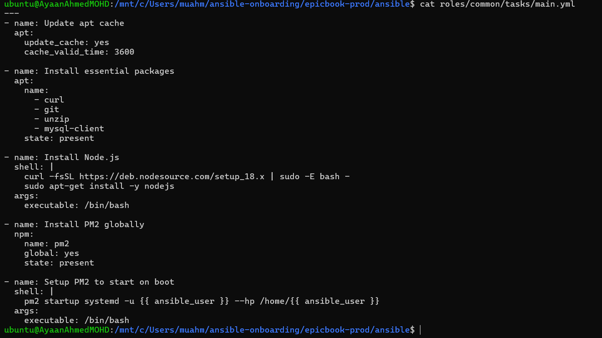

### Notes

Answer the following in your own words:

**1. What is the responsibility of the `common` role?**

The common role prepares the Ubuntu server for the EpicBook deployment. It updates the APT cache and installs the basic tools and software required by the application, including Git, curl, unzip, MySQL client, Node.js, and PM2.

**2. Why should Nginx installation not be placed inside the `common` role?**

Nginx has a separate responsibility from the basic server setup. Keeping Nginx in its own role makes the Ansible project more modular and easier to maintain. The common role should contain software and configuration that is generally required by the server, while the Nginx role should handle web-server-specific configuration.

**3. Why is `mysql-client` useful in this deployment?**

The MySQL client provides command-line tools that allow us to connect to and troubleshoot the Azure MySQL database from the VM. It is useful for checking database connectivity and performing basic database administration tasks. The assignment specifically includes mysql-client among the essential packages installed by the common role.

# Task 7 — Create the `nginx` Role

## Goal

Create the `nginx` role to install Nginx and configure it as a reverse proxy for the EpicBook application.

Nginx will receive browser traffic on port `80` and forward it to the EpicBook Node.js application running on the VM.

### Evidence

#### Screenshot 13 — `roles/nginx/tasks/main.yml` showing Nginx installation and site configuration tasks

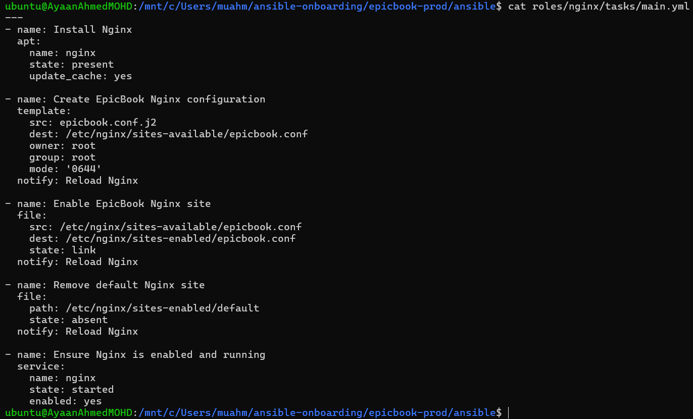

#### Screenshot 14 — `roles/nginx/templates/epicbook.conf.j2` showing the reverse proxy configuration

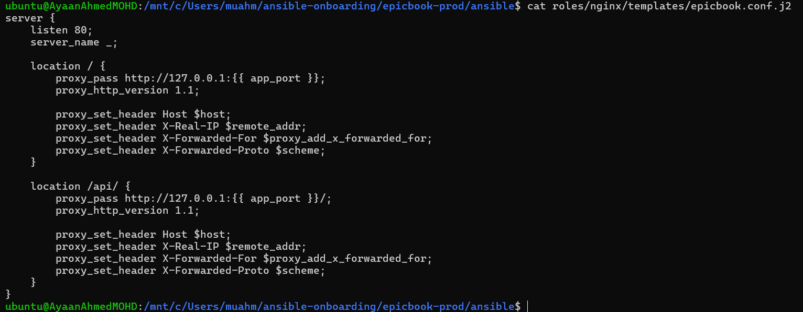

### Notes

Answer the following in your own words:

**1. What is the responsibility of the `nginx` role?**

The nginx role installs and configures Nginx on the Ubuntu VM. It creates the EpicBook site configuration, enables the site, removes the default configuration, and ensures that Nginx is running.

**2. Why is Nginx configured as a reverse proxy in this deployment?**

Nginx receives the user's HTTP request on port 80 and forwards the request to the EpicBook Node.js application running locally on the VM. This provides a single web entry point while keeping the application server behind Nginx. The assignment specifically uses Nginx to serve the application and proxy API requests to the Node backend.

**3. Why should the application port come from `group_vars/web.yml` instead of being hard-coded?**

Keeping the application port in group_vars/web.yml makes the configuration easier to maintain and reuse. If the application changes from port 3000 to another port, I only need to update the variable instead of modifying the Nginx role or template.

# Task 8 — Create the `epicbook` Role

## Goal

Create the `epicbook` role to deploy the EpicBook application, connect it to the managed MySQL database, and run the application on port `8080` using PM2.

### Evidence

#### Screenshot 15 — `roles/epicbook/tasks/main.yml` showing application deployment tasks

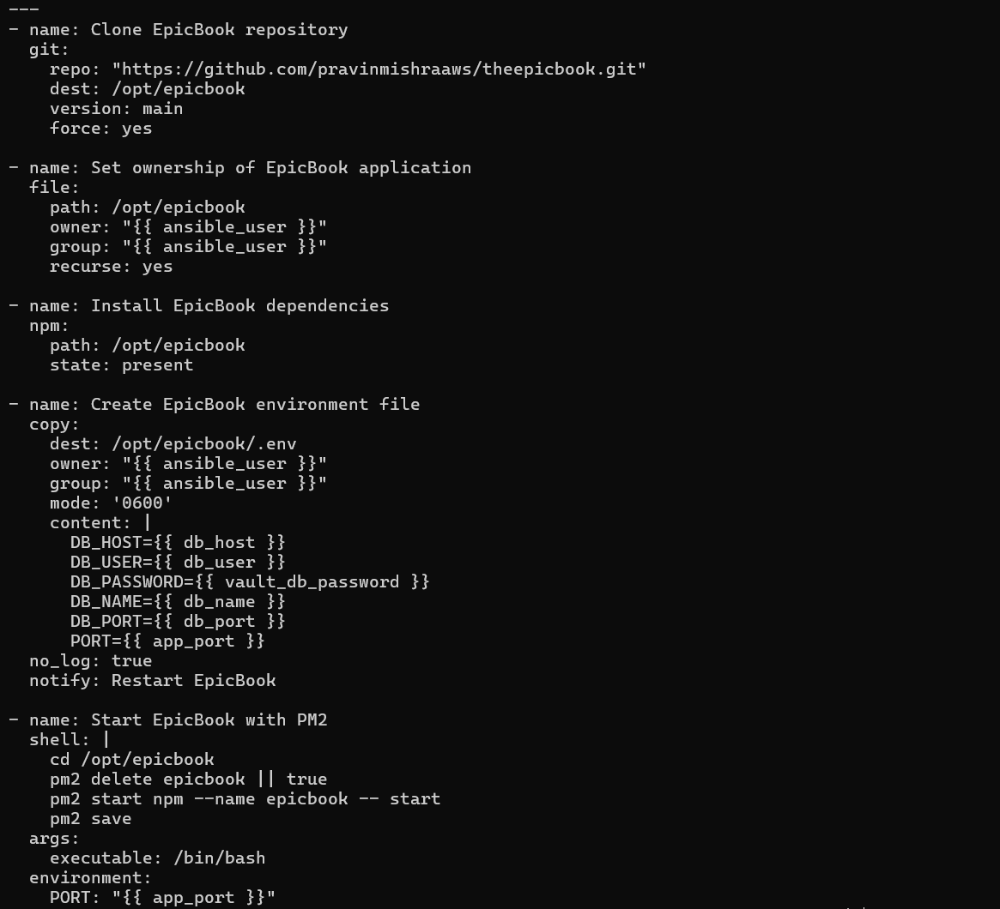

#### Screenshot 16 — Task or file showing how the database connection is configured, with secrets hidden

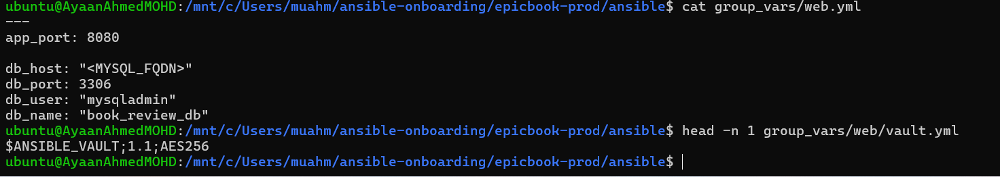

#### Screenshot 17 — Task or output showing the EpicBook application managed by PM2

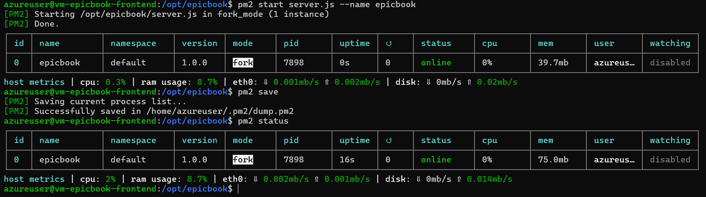

### Notes

Answer the following in your own words:

**1. What is the responsibility of the `epicbook` role?**

The epicbook role is responsible for deploying and configuring the EpicBook Node.js application. It handles the application setup, database configuration, installation of required dependencies, and running the application on port 8080 using PM2.

**2. Why is PM2 used for the EpicBook Node.js application?**

PM2 is used to keep the Node.js application running as a background service. It can automatically restart the application if it crashes and can restore the application after a server reboot, helping improve application availability.

**3. Why should database passwords not be hard-coded in public files?**

Database passwords are sensitive credentials. Hard-coding them in public files or source code can expose the database to unauthorized users if the files are shared, committed to GitHub, or accessed by someone who should not have the credentials. Secrets should instead be stored securely using tools such as Ansible Vault or a secret-management service.

**4. What does it mean for the application to run on port `8080` while Nginx listens on port `80`?**

It means the Node.js application runs internally on port 8080, while Nginx acts as the public-facing reverse proxy on port 80. When a user sends a request to port 80, Nginx receives it and forwards the request to the Node.js application on port 8080.

# Task 9 — Create Group Variables

## Goal

Create reusable variables for the EpicBook deployment.

The `group_vars/web.yml` file stores values that can be reused across the Ansible roles.

### Evidence

#### Screenshot 18 — `group_vars/web.yml` showing the application, PM2, and database variables, with passwords hidden or masked

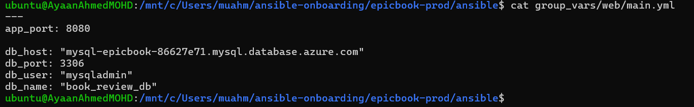

### Notes

Answer the following in your own words:

**1. What is the purpose of `group_vars/web.yml`?**

group_vars/web.yml stores variables that are shared by the hosts in the web group. It allows the Ansible roles to use common application and database settings without hard-coding those values inside each role.

**2. Which values did you store in `group_vars/web.yml`?**

I stored the EpicBook application and database configuration values, including:

Application port: 8080
Database host: Azure MySQL Flexible Server hostname
Database port: 3306
Database name: book_review_db
Database username: mysqladmin
Database password as a protected Ansible Vault variable

These variables can then be reused by the nginx and epicbook roles.

**3. How did you handle the database password securely?**

I stored the database password using Ansible Vault instead of keeping it as plain text in the variables file. This prevents the actual password from being exposed in the Ansible project or screenshots while still allowing Ansible to decrypt and use it during deployment.

# Task 10 — Run the Ansible Playbook

## Goal

Run the Ansible playbook to configure the VM and deploy the EpicBook application.

The playbook should run the roles in this order:

1. `common`
2. `nginx`
3. `epicbook`

### Evidence

#### Screenshot 19 — Ansible playbook output showing the roles running

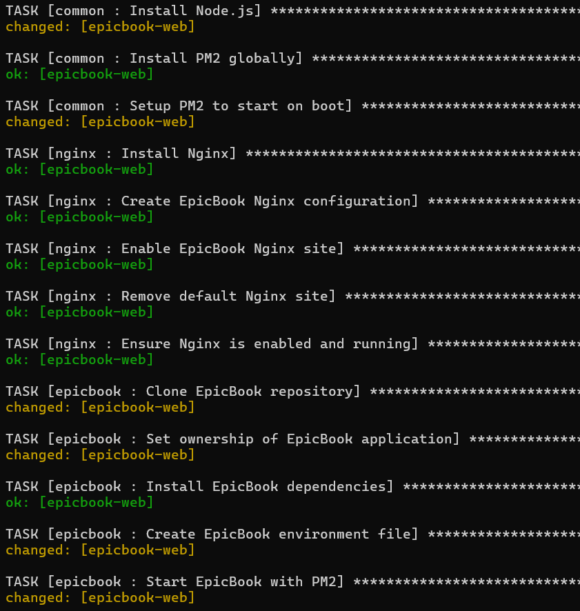

#### Screenshot 20 — Final Ansible recap showing `failed=0`

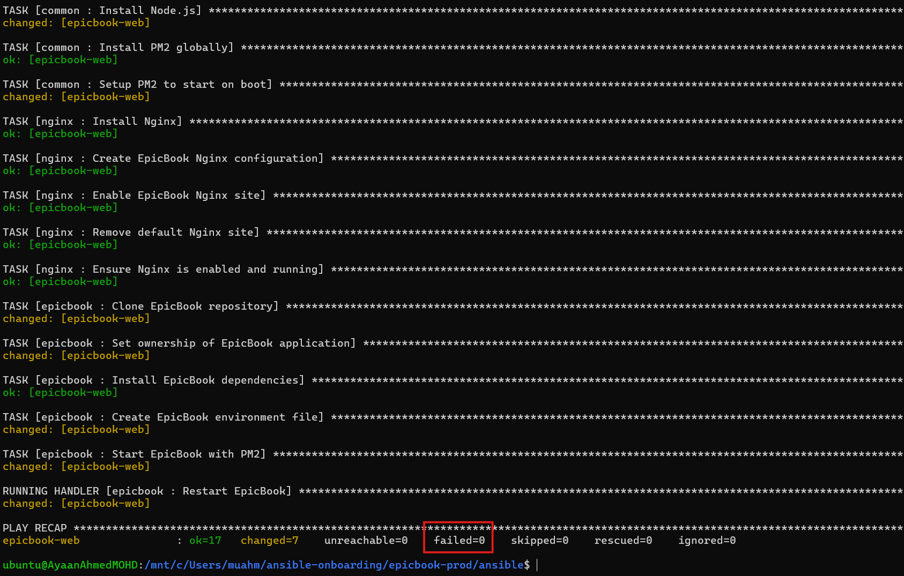

#### Screenshot 21 — Output of `ansible web -i inventory.ini -m command -a "systemctl is-active nginx" --become`

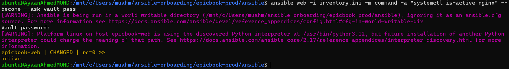

#### Screenshot 22 — Output of `ansible web -i inventory.ini -m command -a "pm2 status"`

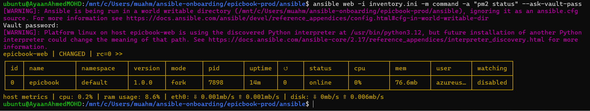

#### Screenshot 23 — Output of `ansible web -i inventory.ini -m command -a "curl -I http://localhost:8080"`

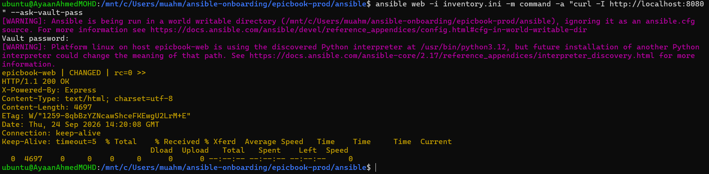

### Notes

Answer the following in your own words:

**1. What command did you run to execute the Ansible playbook?**

I ran the following command from the Ansible directory:

ansible-playbook -i inventory.ini site.yml --ask-vault-pass

The --ask-vault-pass option allows Ansible to decrypt the protected database credentials stored using Ansible Vault.

**2. How do you know all roles completed successfully?**

I checked the final Ansible play recap. The deployment completed successfully when the recap showed:

failed=0

The playbook also showed the common, nginx, and epicbook roles executing without failures.

**3. What proves that Nginx is active?**

I ran:

ansible web -i inventory.ini -m command -a "systemctl is-active nginx" --become

The output returned:

active

This confirms that the Nginx service is running on the web VM.

**4. What proves that PM2 is managing the EpicBook application?**

I ran:

ansible web -i inventory.ini -m command -a "pm2 status"

The PM2 process list showed the epicbook application with its status as:

online

This confirms that PM2 is managing the Node.js application.

**5. What proves that the EpicBook application responds on port `8080`?**

I ran:

ansible web -i inventory.ini -m command -a "curl -I http://localhost:8080"

The response returned an HTTP status such as:

HTTP/1.1 200 OK

This confirms that the EpicBook Node.js application is listening and responding on port 8080.

# Task 11 — Verify the EpicBook Deployment

## Goal

Verify that the EpicBook application is running, accessible in the browser, and connected to the managed MySQL database.

### Evidence

#### Screenshot 24 — Output of `curl -I http://<public_ip>`

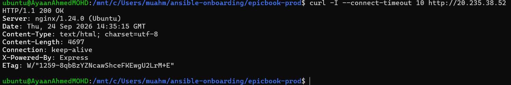

#### Screenshot 25 — Output of the cart API test command

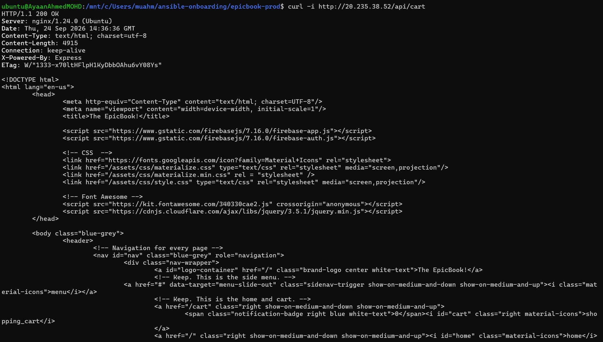

#### Screenshot 26 — Output of the `/cart` HTTP status check

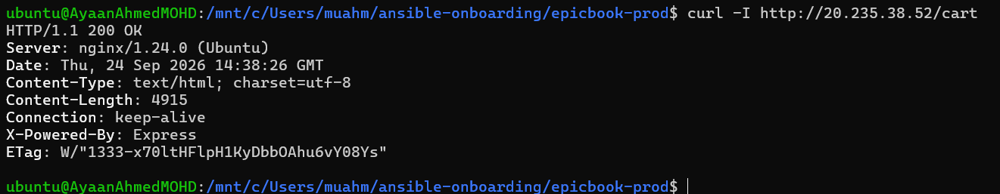

#### Screenshot 27 — Browser showing the EpicBook application loaded from `http://<public_ip>`

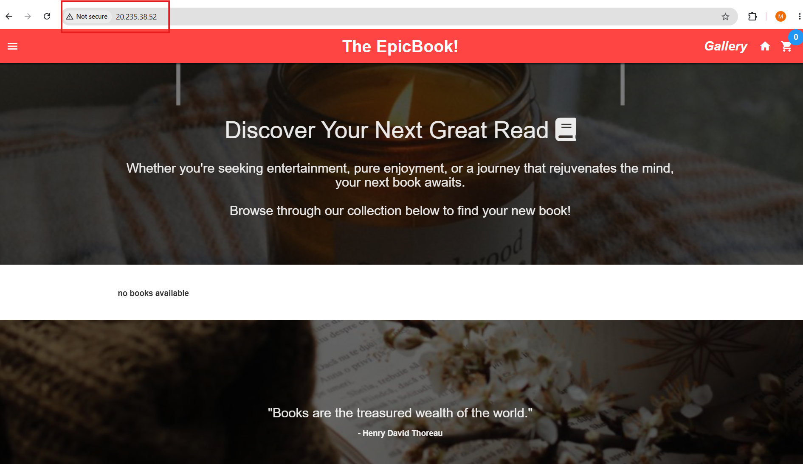

### Notes

Answer the following in your own words:

**1. What HTTP response did you receive from the public application URL?**

The public application URL returned:

HTTP/1.1 200 OK

This confirmed that the EpicBook application was accessible through the public IP.

**2. What did the cart API test prove?**

The cart API test proved that the application's cart API endpoint was reachable and responding correctly through the deployed application.

**3. What did the `/cart` status check return?**

The /cart HTTP status check returned:

HTTP/1.1 200 OK

This confirmed that the /cart route was available and responding successfully.

**4. What issue did you face during verification, and how did you fix it?**

During verification, the public application was initially not reachable on port 80. The application and Nginx were working locally, but the Azure Network Security Group did not have an inbound rule allowing HTTP traffic on port 80.

I added an Allow-HTTP inbound NSG rule for TCP port 80 with a unique priority. After that, the public IP became reachable and the application could be accessed through Nginx.

# LinkedIn Post Required

## Evidence

#### LinkedIn Post URL

Paste your LinkedIn post URL here:

https://lnkd.in/p/dpeBpjye

#### Screenshot — Published LinkedIn post

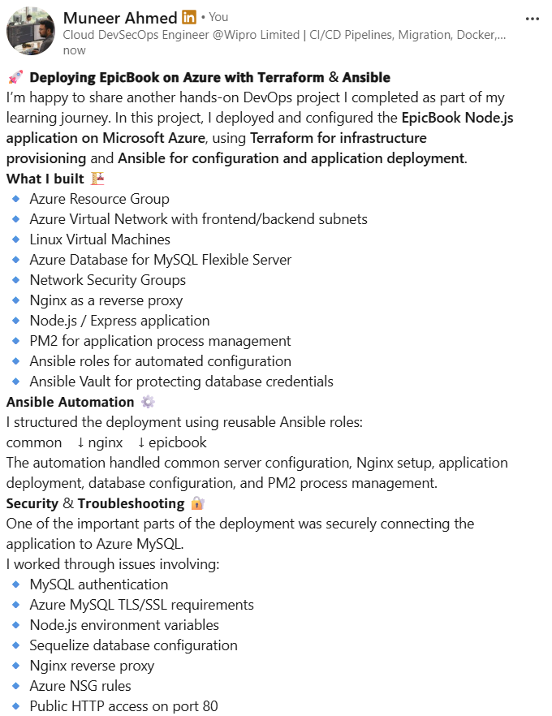

# Assignment Questions

Answer the following in your own words:

**1. Why is Terraform used for infrastructure provisioning?**

Terraform is used to automatically create and manage infrastructure using configuration files. In this deployment, it was used to provision Azure resources such as the Resource Group, VNet, subnets, virtual machines, NSGs, public IPs, MySQL Flexible Server, and database. It makes the infrastructure repeatable, consistent, and easier to manage.

**2. Why are Ansible roles useful for production-style deployments?**

Ansible roles divide the deployment into reusable and organized components. In this project, the deployment was separated into common, nginx, and epicbook roles. This makes the playbook easier to maintain, troubleshoot, reuse, and extend as the environment becomes larger.

**3. What is the purpose of `group_vars/web.yml`?**

group_vars/web.yml stores variables shared by the hosts in the web group. In this deployment, it contains values such as the application port, database host, database port, database name, and database username. Sensitive database credentials are protected using Ansible Vault instead of being stored as plain text.

**4. Why should database passwords not be committed to GitHub?**

Database passwords are sensitive credentials. If they are committed to GitHub, someone who gains access to the repository could potentially use them to access the database. Therefore, passwords should be stored securely using mechanisms such as Ansible Vault, GitHub Secrets, Azure Key Vault, or another secret-management solution.

**5. What is the purpose of Nginx in this deployment?**

Nginx acts as a reverse proxy and public entry point for the application. Users access the application through HTTP port 80, and Nginx forwards the requests internally to the Node.js/Express application running on port 8080. This also separates the public web layer from the application process.

**6. Why should the managed MySQL database not be publicly accessible?**

A database should not normally be directly exposed to the public internet because it increases the attack surface and creates additional security risks. Ideally, the application should access MySQL through private networking, with firewall/NSG rules restricting access to only the required application servers.

**7. Why is PM2 used for the EpicBook Node.js application?**

PM2 is used to manage the Node.js application as a background service. It keeps the EpicBook application running, can restart it if the application fails, and can maintain the application process after server restarts. In this deployment, PM2 runs the EpicBook application on port 8080.

**8. What does idempotency mean in Ansible?**

Idempotency means that running the same Ansible playbook multiple times should produce the same desired final state without unnecessarily changing resources that are already correctly configured. For example, if Nginx is already installed and configured correctly, running the playbook again should not reinstall or unnecessarily modify it.

**9. What issue did you face during the deployment, and how did you fix it?**

One major issue was that the EpicBook application initially tried to connect to MySQL using 127.0.0.1:3306 instead of the Azure MySQL server. The application configuration was updated to use the Azure MySQL hostname and environment variables. We also installed dotenv and updated the Sequelize configuration. Azure MySQL required secure transport, so SSL/TLS configuration was added to the Sequelize connection. After that, the application successfully connected to MySQL and started on port 8080.

Another deployment issue was that the application was not initially reachable from the internet because TCP port 80 was not allowed in the Azure NSG. An Allow-HTTP rule was added, after which the application became accessible through the public IP.

**10. What security improvement would you make before using this setup in production?**

Before production, I would make the database private instead of publicly accessible, restrict NSG and database firewall rules to only the required sources, and use a proper secret-management solution such as Azure Key Vault. I would also use a trusted Azure MySQL CA certificate instead of disabling certificate validation with rejectUnauthorized: false, enable HTTPS with a valid TLS certificate on Nginx, and ensure SSH access is restricted and monitored.

# Required Files

Confirm that the following files are included in your GitHub repository or assignment folder:

- [x] `README.md`
- [x] Terraform files under either `terraform/azure/` or `terraform/aws/`
- [x] `ansible/ansible.cfg`
- [x] `ansible/inventory.ini`
- [x] `ansible/site.yml`
- [x] `ansible/group_vars/web.yml`
- [x] `ansible/roles/common/tasks/main.yml`
- [x] `ansible/roles/nginx/tasks/main.yml`
- [x] `ansible/roles/nginx/templates/epicbook.conf.j2`
- [x] `ansible/roles/epicbook/tasks/main.yml`

---

# Submission Instructions

- Add all required screenshots in your submission.
- Full Name must be visible in required screenshots.
- Mention the cloud provider used: Azure or AWS.
- Add the VM public IP address.
- Add the final application URL.
- Add Terraform output proof.
- Add Ansible role tree proof.
- Add all required notes and assignment question answers.
- Add your LinkedIn post URL.
- Do not expose SSH private keys, passwords, cloud credentials, database credentials, Terraform state files, subscription IDs, or account IDs.

---

# Completion Checklist

- [x] Task 1: Project folder layout created
- [x] Task 2: Terraform infrastructure provisioned
- [x] Task 3: SSH key-based access verified
- [x] Task 4: Ansible inventory and configuration created
- [x] Task 5: Main Ansible playbook created
- [x] Task 6: `common` role created
- [x] Task 7: `nginx` role created
- [x] Task 8: `epicbook` role created
- [x] Task 9: Group variables created
- [x] Task 10: Ansible playbook run completed
- [x] Task 11: EpicBook deployment verified
- [x] Terraform files created under only one cloud provider folder
- [x] One Ubuntu VM was created
- [x] One managed MySQL database was created
- [x] SSH port `22` is restricted to the controller public IP
- [x] HTTP port `80` is accessible
- [x] MySQL port `3306` is not publicly open
- [x] `ansible web -i inventory.ini -m ping` returns `SUCCESS`
- [x] `site.yml` calls the roles in the correct order
- [x] Database secrets are hidden or handled securely
- [x] Nginx is active
- [x] PM2 shows the EpicBook application running
- [x] EpicBook responds on port `8080`
- [x] Public URL loads in the browser
- [x] Cart API verification works
- [x] Playbook completes with `failed=0`
- [x] Screenshots 1–27 are included
- [x] Assignment questions are answered
- [x] LinkedIn post published
- [x] LinkedIn post URL added
- [x] No sensitive information is exposed

---

## About DMI & CloudAdvisory

DevOps Micro Internship (DMI) is a project-based DevOps program run by Pravin Mishra and The CloudAdvisory, focused on real-world execution, systems thinking, and career readiness.

It helps learners build strong DevOps foundations with hands-on experience.

---

## Resources

- DMI Official Website: [https://dmi.pravinmishra.com?utm_source=github&utm_medium=readme](https://dmi.pravinmishra.com?utm_source=github&utm_medium=readme)
- University: [https://university.pravinmishra.com?utm_source=github&utm_medium=readme](https://university.pravinmishra.com?utm_source=github&utm_medium=readme)
- Discord Community: [https://discord.pravinmishra.com?utm_source=github&utm_medium=readme](https://discord.pravinmishra.com?utm_source=github&utm_medium=readme)
- Blog: [https://dmi.pravinmishra.com/blog?utm_source=github&utm_medium=readme](https://dmi.pravinmishra.com/blog?utm_source=github&utm_medium=readme)
- YouTube Playlist: [https://www.youtube.com/playlist?list=PLFeSNDtI4Cho](https://www.youtube.com/playlist?list=PLFeSNDtI4Cho)
- Pravin Mishra LinkedIn: [https://www.linkedin.com/in/pravin-mishra-aws-trainer/](https://www.linkedin.com/in/pravin-mishra-aws-trainer/)
- CloudAdvisory LinkedIn: [https://www.linkedin.com/company/thecloudadvisory/](https://www.linkedin.com/company/thecloudadvisory/)

---

*This submission is part of DevOps Micro Internship (DMI) — Agentic AI Track.*